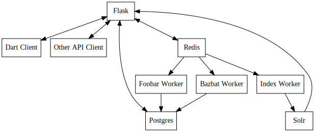

QuickPin Technical Guide[¶](#quickpin-technical-guide "Permalink to this headline")
===================================================================================


-----------------------------------------------------------

Note

QuickPin is prototype software that is in the *very* early stages of development. The software and the documentation are subject to change without notice.

QuickPin is a tool for quickly examining social networks, such as Twitter, to identify individuals and groups that are related to specified topics.

[Architecture](#id1)[¶](#architecture "Permalink to this headline")
-------------------------------------------------------------------

Contents

-   [Architecture](#architecture)
    -   [Diagram](#diagram)
    -   [Dart & Other API Clients](#dart-other-api-clients)
    -   [Flask](#flask)
    -   [Postgres](#postgres)
    -   [Solr](#solr)
    -   [Redis](#redis)
    -   [Workers](#workers)

### [Diagram](#id2)[¶](#diagram "Permalink to this headline")

The following diagram shows the high level components of this system and how they are interconnected.



### [Dart & Other API Clients](#id3)[¶](#dart-other-api-clients "Permalink to this headline")

The web client is written in Dart as a single-page application (SPA) that communicates with the server exclusively through the API (and also to load static assets). This design ensures that anything that can be done through the human user interface can also be done by a machine through the REST API. It also opens up the possibility of writing clients for other platforms, such as Android or iOS.

Although primarily targeting desktop/laptop users, the Dart client is also intended (although not yet thoroghly tested) to work smoothly on smaller devices like tablets and phones. The Dart client should scale its UI appropriately for all of these devices and should be accessible to users who are not using a mouse.

### [Flask](#id4)[¶](#flask "Permalink to this headline")

Flask is the main application server and the hub of the entire system. It exposes a REST API for communication with its clients. It also serves static assets such as Dart/JavaScript source code, images, styles, etc. Flask also interacts with various data stores to persist and query data.

Note

We use Apache as sort of a front-end proxy for Flask because Apache automatically manages workers (Flask does not) and Apache can serve static assets much more quickly than Flask. Apache and WSGI are transparent in this setup, so we did not include them in the diagram above.

### [Postgres](#id5)[¶](#postgres "Permalink to this headline")

The application uses Postgres as its authoritative data store. Redundant data may be stored in other places (e.g. Redis, Solr) but in the case of conflicts, Postgres is always assumed to be correct.

### [Solr](#id6)[¶](#solr "Permalink to this headline")

Solr is a search engine that allows for complex keyword queries and faceted searches. It also provides useful utilities for a search engine, such as highlighting and paging. Solr is kept in sync with Postgres through the Redis message queue.

### [Redis](#id7)[¶](#redis "Permalink to this headline")

Redis serves two purposes: it is both a cache and a message queue. The cache is used to store state that is expensive to compute and changes infrequently. The message queue is used for decentralized processing. In particular, we want the REST API to have low latency. Any API call that triggers lengthy computation should be delegated to an external worker using the message queue, allowing the API to return a response before that lengthy computation finishes.

### [Workers](#id8)[¶](#workers "Permalink to this headline")

As an example of an external worker, the Index Worker handles requests to update search indicies. In a typical workflow, the Flask server will process an API request that updates some data in Postgres. Postgres and Solr are now inconsistent, and the Solr index needs to be updated in order to become consistent again. Flask will queue a request with Redis, Redis will dequeue the request to an index worker, and then the worker will update the Solr index.

[Installation Guide](#id1)[¶](#installation-guide "Permalink to this headline")
-------------------------------------------------------------------------------

Contents

-   [Installation Guide](#installation-guide)
    -   [Production Installation](#production-installation)
    -   [Developer Installation](#developer-installation)
        -   [Create QuickPin User](#create-quickpin-user)
        -   [Dependencies](#dependencies)
        -   [Permissions](#permissions)
        -   [Local.ini](#local-ini)
        -   [Database (PostgreSQL)](#database-postgresql)
        -   [Supervisord](#supervisord)
        -   [Development Server](#development-server)
        -   [Dartium](#dartium)
        -   [Dart Build](#dart-build)
        -   [Apache Server](#apache-server)

### [Production Installation](#id2)[¶](#production-installation "Permalink to this headline")

We anticipate having a [“Dockerized”](https://www.docker.com/) build to use in production. For now, if you want to install a production instance, you should follow the Developer Installation below.

### [Developer Installation](#id3)[¶](#developer-installation "Permalink to this headline")

These instructions will help you get a development environment up and running on an Ubuntu 14.04 host. **We assume that you already have the QuickPin project checked out at /opt/quickpin.**

#### [Create QuickPin User](#id4)[¶](#create-quickpin-user "Permalink to this headline")

For security reasons, we recommend that you run QuickPin under its own segregated user account. Create a quickpin user as follows:

    $ sudo useradd -m quickpin

QuickPin will have read access to most of its files and directories. It will have write access only to a very small subset of its files and directories.

#### [Dependencies](#id5)[¶](#dependencies "Permalink to this headline")

We assume that you have a way of managing conflicting dependencies, e.g. you are using a virtual machine or venv or … something that keeps other projects from interfering with QuickPin.

First, install these build dependencies. (We are making this a separate step so that it’s easy to automate our build process in the future.)

    $ sudo apt-get -y install curl wget python-dev unzip

Now, before we start installing the main dependencies, we need to add the Dart package repository to APT.

    $ sudo sh -c 'curl https://dl-ssl.google.com/linux/linux_signing_key.pub | apt-key add -'
    $ sudo sh -c 'curl https://storage.googleapis.com/download.dartlang.org/linux/debian/dart_stable.list > /etc/apt/sources.list.d/dart_stable.list'
    $ sudo apt-get update

We also need to ensure we have an up to date version of node.

    $ sudo apt-get remove -y nodejs npm
    $ curl -sL https://deb.nodesource.com/setup_4.x | sudo bash -

Now, we can install some dependencies via APT.

    $ sudo apt-get install -y apache2 dart libapache2-mod-wsgi-py3 \
                              build-essential tcl8.5 apt-transport-https \
                              redis-server dart postgresql postgresql-contrib \
                              openjdk-7-jre-headless libcurl4-gnutls-dev python3-bcrypt \
                              python3-dateutil python3-lxml python3-pip python3-psycopg2 \
                              supervisor supervisor zlib1g-dev libtiff4-dev \
                              libjpeg8-dev libfreetype6-dev liblcms1-dev libwebp-dev

If you want to build documentation, then you’ll also need Sphinx:

    $ sudo apt-get -y install graphviz python3-sphinx
    $ sudo pip3 install alabaster sphinxcontrib-httpdomain

Tip

You may also wish to install the `git` package right now, if that’s how you are getting source code into your environment.

**At this point, you should have the QuickPin source code stored at the path \`\`/opt/quickpin\`\`.** Now install the Python dependencies.

    $ sudo pip3 install -r /opt/quickpin/install/python-dependencies.txt

Important

**This project runs Python 3!** In order to avoid accidentally running Python 2, you may want to alias `python` to `python3` and alias `pip` to `pip3`. It is not recommended to symlink `python` to `python3` in case any system scripts depend on Python 2.

Our Dart code has other Dart dependencies that we need to install, using Dart’s package manager called “Pub”. Set up some symlinks so that `pub` is in your path.

    $ sudo find /usr/lib/dart/bin/ -type f -executable \
          -exec ln -s {} /usr/local/bin/ \;
    $ sudo ln -s /usr/lib/dart /usr/lib/dart/bin/dart-sdk

Note

The second instruction is there to handle a [current bug](http://code.google.com/p/dart/issues/detail?id=21225) in one of our Dart libraries. It should be fixed soon when we upgrade to Angular 1.1.

By default, Pub will try to cache dependencies in `~/.pub-cache`, but this can be annoying if you want to install as root but run as a less privileged user. (The dependencies would be installed in `/root/.pub-cache` but QuickPin would look for them in `/home/quickpin/.pub-cache`.) Therefore, we’ll make a system-wide Pub cache and export it through a `PUB_CACHE` environment variable.

    $ export PUB_CACHE=/opt/pub-cache
    $ sudo -E mkdir -p $PUB_CACHE

Note the `-E` argument to `sudo` to make sure that it can see the `PUB_CACHE` environment variable.

You should probably add `PUB_CACHE` to your `.profile` (or similar) so that you don’t need to remember to export this variable every time you log in.

We also need to install the less package for node using npm, as the ubuntu version is out of date:

    $ sudo npm install -g less

Now we can use Pub to bring in our dependencies.

    $ cd /opt/quickpin/static/dart
    $ sudo -E pub get
    ...snip...

Pub has some issues with weird permissions, so we also want to fix up permissions before we continue. I created an alias for this so that I can fix permissions whenever I use pub to update dependencies.

    $ cat >> ~/.bash_aliases
    alias fixpub='sudo chown -R root:root /opt/pub-cache; sudo find /opt/pub-cache -type f -exec chmod 644 {} \; ; sudo find /opt/pub-cache -type d -exec chmod 755 {} \;'
    <Ctrl+D>
    $ . ~/.bash_aliases
    $ fixpub

You’ll want to run `fixpub` any time you use `pub get` or `pub upgrade`.

Next, you need to set up Node.js. We already installed the Node.js package above, but we also need to symlink `node` to `nodejs` since some older packages expect the Node.js executable to be called `node`.

    $ sudo ln -s /usr/bin/nodejs /usr/local/bin/node

Now upgrade the Dart packages.

    $ cd /opt/quickpin/static/dart
    $ sudo -E pub upgrade
    $ fixpub

Finally, the last step is to get the Solr search engine installed. Begin by downloading version 5.x [from here](http://mirror.cc.columbia.edu/pub/software/apache/lucene/solr/).

The archive contains an installer script, so you just need to extract that one script and run it. You can extract the installer like this:

    $ tar xzf solr-5.2.1.tgz \
              solr-5.2.1/bin/install_solr_service.sh \
              --strip-components=2

(You’ll need to adjust the `5.2.1` to match the version that you actually downloaded.)

After the installer is extracted, you can run it to set up Solr on your sytem — just make sure to pass the name of the archive you download as an argument to the installer script.

    $ sudo ./install_solr_service.sh solr-5.2.1.tgz
    id: solr: no such user
    Creating new user: solr
    Adding system user `solr' (UID 105) ...
    Adding new group `solr' (GID 113) ...
    Adding new user `solr' (UID 105) with group `solr' ...
    Creating home directory `/home/solr' ...
    Extracting solr-5.0.0.zip to /opt
    Creating /etc/init.d/solr script ...
     Adding system startup for /etc/init.d/solr ...
       /etc/rc0.d/K20solr -> ../init.d/solr
    ...

(Once again, adjust the `5.2.1` to match the version that you actually downloaded.)

The installer script puts the Solr server in `/opt/solr`, puts Solr data in `/var/solr`, and adds a service script in `/etc/init.d/solr` so that you can control Solr like any other Linux service.

    $ sudo service solr status

    Found 1 Solr nodes:

    Solr process 23399 running on port 8983
    {
      "solr_home":"/var/solr/data/",
      "version":"5.0.0 1659987 - anshumgupta - 2015-02-15 12:26:10",
      "startTime":"2015-03-24T04:37:29.172Z",
      "uptime":"0 days, 0 hours, 1 minutes, 50 seconds",
      "memory":"33.7 MB (%6.9) of 490.7 MB"}

Solr will also be configured to start automatically during bootup. You can access a Solr admin panel by going to port `8983` in your browser.

Warning

By default, Solr listens on `0.0.0.0`. I’m not sure how to configure it to listen on the loopback interface only. This is something I will look into later.

To prepare Solr for use, create a new core called “quickpin”.

    $ sudo -u solr /opt/solr/bin/solr create -c quickpin

    Setup new core instance directory:
    /var/solr/data/quickpin

    Creating new core 'quickpin' using command:
    http://localhost:8983/solr/admin/cores?action=CREATE&name=quickpin&instanceDir=quickpin

    {
      "responseHeader":{
        "status":0,
        "QTime":980},
      "core":"quickpin"}

That’s it! Solr is installed and configured.

#### [Permissions](#id6)[¶](#permissions "Permalink to this headline")

QuickPin expects to have a writeable log file at `/var/log/quickpin.log` and expects to be able to write to the application’s `data` directory.

    $ sudo touch /var/log/quickpin.log
    $ sudo chown quickpin:quickpin /var/log/quickpin.log
    $ sudo chown quickpin:quickpin /opt/quickpin/data

QuickPin also minifies and combines some static resources, such as JavaScript and CSS. It needs to store these static resources in `/opt/quickpin/static/combined` and `/opt/quickpin/static/.webassets-cache`, which both need to be writable by the user running QuickPin.

    $ sudo mkdir -p /opt/quickpin/static/combined \
                    /opt/quickpin/static/.webassets-cache
    $ sudo chown -R quickpin:quickpin \
                    /opt/quickpin/static/combined \
                    /opt/quickpin/static/.webassets-cache

#### [Local.ini](#id7)[¶](#local-ini "Permalink to this headline")

QuickPin includes a layered configuration system. First, it expects a file called `conf/system.ini`, and it reads configuration data from that file. Next, it looks for a file called `conf/local.ini`. If this file exists, then it will be read in and any configurations it specifies will *override* the corresponding values in `system.ini`.

We keep `system.ini` version controlled and it *should not be edited* on a per-site basis. On the other hand, `local.ini` is *not stored in version control* and any site specific settings should be placed in there. We include a `local.ini.template` just for this purpose.

    $ sudo cp /opt/quickpin/conf/local.ini.template \
              /opt/quickpin/conf/local.ini

You should edit local.ini and provide values for the following keys:

-   username: The application username. We recommend the name ‘quickpin’.
-   password: Generate a secure password for the application user.
-   super\_username: The user used for database administration. We recommend the name ‘quickpin\_su’.
-   super\_password: Generate a secure password for the super user.
-   SECRET\_KEY: A cryptographic key that Flask uses to sign authentication tokens. Set this to a long, random string, for example by running `openssl rand -base64 30`.

Whatever values you pick, keep them handy: you’ll need them in the next section. You can also configure non-standard setups by overriding other values from system.ini in the local.ini.

#### [Database (PostgreSQL)](#id8)[¶](#database-postgresql "Permalink to this headline")

If you followed the steps above, you’ve already installed PostgreSQL. Now we need to add some credentials for QuickPin to use when accessing PostgresSQL.

You should set `super_password` below to the same password that you put in the `super_password` field in local.ini. You should set `regular_password` to the `password` field in local.ini.

    $ sudo -u postgres createdb quickpin
    $ sudo -u postgres psql quickpin
    psql (9.3.6)
    Type "help" for help.

    quickpin=# DROP EXTENSION plpgsql;
    DROP EXTENSION
    quickpin=# CREATE USER quickpin_su PASSWORD 'super_password';
    CREATE ROLE
    quickpin=# ALTER DATABASE quickpin OWNER TO quickpin_su;
    ALTER DATABASE
    quickpin=# CREATE USER quickpin PASSWORD 'regular_password';
    CREATE ROLE
    quickpin=# ALTER DEFAULT PRIVILEGES FOR USER quickpin_su GRANT SELECT, INSERT, UPDATE, DELETE ON TABLES TO quickpin;
    ALTER DEFAULT PRIVILEGES
    quickpin=# ALTER DEFAULT PRIVILEGES FOR USER quickpin_su GRANT USAGE ON SEQUENCES TO quickpin;
    ALTER DEFAULT PRIVILEGES
    quickpin=# \q

Note

If you’re looking for a graphical Postgres client, [pgAdmin](http://www.pgadmin.org/) is cross platform, open source, and quite good.

Finally, QuickPin needs to initialize its database tables and load some data fixtures.

    $ sudo -u quickpin python3 /opt/quickpin/bin/database.py build
    2015-03-21 06:03:43 [cli] INFO: Dropping existing database tables.
    2015-03-21 06:03:43 [cli] INFO: Running Agnostic's bootstrap.
    2015-03-21 06:03:43 [cli] INFO: Creating database tables.
    2015-03-21 06:03:43 [cli] INFO: Creating fixture data.

You can re-run this command at any point in order to clear out the database and start from scratch. You can also pass a `--sample-data` flag to get some sample data included in the database build.

Note

By default, Postgres is only accessible on a local Unix socket. If you want to be able to access Postgres remotely for development purposes, add a line to the /etc/postgres/.../pg\_hba.conf file like this:

host all all 192.168.31.0/24 trust

This line allows TCP connections from the specified subnet. Restart Postgres after changing this configuration value.

#### [Supervisord](#id9)[¶](#supervisord "Permalink to this headline")

Most of the daemons we use have `init` scripts and launch automatically when the system boots, but some of them do not. For this latter category, we use `supervisord` to make sure these processes start, and in the event that a process unexpectedly fails, `supervisord` will automatically restart it.

    $ sudo cp /opt/quickpin/install/supervisor.conf \
              /etc/supervisor/conf.d/quickpin.conf
    $ sudo killall -HUP supervisord

#### [Development Server](#id10)[¶](#development-server "Permalink to this headline")

You should now be able to run a development server. We are using the [Flask microframework](http://flask.pocoo.org/), which has a handy dev server built in.

    $ cd /opt/quickpin/bin/
    $ sudo -u quickpin python3 run-server.py --debug
     * Running on http://127.0.0.1:5000/ (Press CTRL+C to quit)
     * Restarting with inotify reloader

Warning

Note that the server runs on the loopback interface by default. The Flask dev server allows arbitrary code execution, which makes it extremely dangerous to run the dev server on a public IP address!

If you wish to expose the dev server to a network interface, you can bind it to a different IP address, e.g.:

    $ sudo -u quickpin python3 run-server.py --ip 0.0.0.0 --debug
     * Running on http://0.0.0.0:5000/ (Press CTRL+C to quit)
     * Restarting with inotify reloader

Most of the time, you will want to enable the dev server’s debug mode. This mode has the following features:

-   Automatically reloads when your Python source code changes. (It is oblivious to changes in configuration files, Dart source, Less source, etc.)
-   Disables HTTP caching of static assets.
-   Disables logging to /var/log/quickpin.log. Log messages are still displayed on the console.
-   Uses Dart source instead of the Dart build product. (More on this later.)

You’ll use the dev server in debug mode for 90% of your development.

#### [Dartium](#id11)[¶](#dartium "Permalink to this headline")

If you are running the dev server in debug mode, then it will run the application from Dart source code. This means you need a browser that has a Dart VM! This browser is called *Dartium* and it’s basically the same as Chromium except with Dart support. It has the same basic features, web kit inspector, etc.

*You should use Dartium while you develop.* Download Dartium from the [Dart downloads page](https://www.dartlang.org/tools/download.html). Make sure to download Dartium by itself, not the whole SDK. (You already installed the SDK if you followed the instructions above.)

You can unzip the Dartium archive anywhere you want. I chose to put it in `/opt/dartium`. In order to run Dartium, you can either run it in place, e.g. `/opt/dartium/chrome` or for convenience, you might want to add a symlink:

    $ ln -s /opt/dartium/chrome /usr/local/bin

Now you can run Dart from any directory by typing `dartium`.

Note

At this point, you should be able to run QuickPin by running the dev server in debug mode and using Dartium to access it.

#### [Dart Build](#id12)[¶](#dart-build "Permalink to this headline")

If you run the dev server without `--debug`, it will use the Dart build product instead of the source code. Therefore, you need to run a Dart build if you are going to run a server without debug mode. This same process is used when deploying QuickPin to production.

Don’t forget that you should have `$PUB_CACHE` defined before running this build, and note the use of `sudo -E`.

    $ cd /opt/quickpin/static/dart
    $ sudo -E pub build

Now you can run your dev server in non-debug mode and use QuickPin with a standard web brower such as Chrome. If you encounter any errors in this mode, you’ll find that they are nearly impossible to debug because of the conversion from Dart to JavaScript and the subsequent tree shaking and minification. Add `--mode=debug` to your `pub build` command to generate more readable JavaScript errors.

#### [Apache Server](#id13)[¶](#apache-server "Permalink to this headline")

At some point, you’ll want to test against real Apache, not just the dev server. There are some Apache configuration files in the `/install` directory for this purpose.

    $ sudo cp /opt/quickpin/install/apache.conf \
              /etc/apache2/sites-available/quickpin.conf
    $ sudo cp /opt/quickpin/install/server.*  /etc/apache2/
    $ sudo a2ensite quickpin
    $ sudo a2enmod headers rewrite ssl
    $ sudo a2dissite 000-default default-ssl
    Site 000-default disabled.
    Site default-ssl already disabled
    To activate the new configuration, you need to run:
      service apache2 reload
    $ sudo service apache2 reload
     * Reloading web server apache2

The Apache configuration will always use the Dart build product and it will not automatically reload when Python sources change, so it’s really only useful for final testing. It is very cumbersome to use Apache for active development.

The Apache server uses a self-signed TLS certificate by default, which means that you will get TLS verification errors and an ugly red X. You can [generate your own certificate](http://www.akadia.com/services/ssh_test_certificate.html) and set it to trusted in order to avoid the TLS warnings. QuickPin doesn’t use http/80 (except to redirect to port 443) and it uses [HSTS](http://en.wikipedia.org/wiki/HTTP_Strict_Transport_Security) to encourage user agents to only make requests over https/443.

At this point, you should be able to access QuickPin in a normal browser on port 443!

When you upgrade QuickPin, you can tell Apache to refresh by touching the `/opt/quickpin/application.wsgi` file.

[Security](#id1)[¶](#security "Permalink to this headline")
-----------------------------------------------------------

Contents

-   [Security](#security)
    -   [Architecture](#architecture)
    -   [API Authentication](#api-authentication)
    -   [API Authorization](#api-authorization)
    -   [Client Authentication & Authorization (A&A)](#client-authentication-authorization-a-a)
    -   [Common Web Flaws](#common-web-flaws)
        -   [Cross Site Request Forgery (CSRF)](#cross-site-request-forgery-csrf)
        -   [Cross Site Scripting (XSS)](#cross-site-scripting-xss)
        -   [SQL Injection (sqli)](#sql-injection-sqli)

### [Architecture](#id2)[¶](#architecture "Permalink to this headline")

The application is divided into a client and a server. Ultimately, access control decisions must be enforced by the server, because the client is under the control of the end user. Therefore, authentication and authorization are primarly the concern of the server.

The client does keep track of authentication and authorization state so that it can present a consistent UI to the user: e.g. we don’t want to offer an action to the user if we know the server won’t authorize the user to perform that action. If the user hijacks the client’s authenticaton and authorization data, however, all the user can do is change the UI; the server will rightfully reject any unauthorized requests coming from the client, regardless of the client’s internal state.

The server exposes a REST API that is carefully access controlled, since the API provides access to a great deal of sensitive data within the application. The server is designed to make access control easy and clear for programmers to implement. These details are explained below.

The server also exposes static assets (stylesheets, JavaScript code, Dart code) that are not sensitive. These assets are served without any access control. These assets include some static images that used for the UI elements, but to be clear, sensitive image data collected from crawls is accessible only through the REST API and has appropriate access controls.

### [API Authentication](#id3)[¶](#api-authentication "Permalink to this headline")

Authentication is performed by email address and password. The implementation is in `lib/app/views/authenticate.py`. Authentication is performed by making a REST API call with the email address and password. If authentication succeeds, the server returns an authentication token for the client to use with future requests. (I.e., the server does not need to send the email & username with every single request.)

The returned token is a signed cookie that contains identifying information about the user, such as `1.OYNDujaJL5b8IY069FKEpARkchs`. The cryptographic signature makes token forgery infeasible. The signature is performed with a configurable key in `conf/local.ini`.

To make an authenticated request, the client should place the authentication token in the `X-Auth` header. Additional details on how to perform authentication are described in the REST API section.

A programmer can mark an API endpoint as requiring authentication (e.g. a logged in user) by using the `@login_required` decorator.

    @flask_app.route('/api/authentication')
    @login_required
    def whoami():
        ''' Return information about the current logged in user. '''

        return jsonify(
            id=g.user.id,
            username='admin',
            is_admin=True
        )

This example shows an API endpoint that gives the user information about his/her own account. Obviously this API requires a logged in user, otherwise what would the `user` object be set to?

The `@login_required` decorator should be placed *after* the route decorator in order to indicate that the route requires an auth token. If the auth token is not provided or if the auth token is invalid, the decorator will return an HTTP 401 error. If the authentication token exists and is valid, then the route is allowed and the `g.user` object is populated with the current user object.

Note

If you want to write a view that can conditionally access `g.user`, use the `@login_optional` decorator. This decorator will attach `g.user` to the request context if the user is logged in, but it will not raise a 401 error if the user is not logged in.

### [API Authorization](#id4)[¶](#api-authorization "Permalink to this headline")

Warning

Authorization has not been fully implemented yet. We currently have a single `is_admin` boolean field on the User model in `lib/model/user.py`.

As explained in the previous section, the client must provide an auth token for any request which requires a logged in user. Different users may be authorized to perform different actions. For example, an administrator user can do things that a regular user cannot.

A programmer can mark a route as requiring an administrator by using the `@admin_required` decorator. It is very similar to `@login_required` except that it checks if the authenticated user has administrator level access. If the user is not authorized, the decorator returns an HTTP 403 error.

Note

If you use `@admin_required`, then you do not not need to use `@login_required`.

### [Client Authentication & Authorization (A&A)](#id5)[¶](#client-authentication-authorization-a-a "Permalink to this headline")

As described above, the client keeps track of authentication and authorization state in order to decide what UI elements to show to the user. For example, it should only show the “Administration” menu item to an administrator. If this item was shown to a non-admin user and the user clicked on it, they would see a blank administrator interface, because they are not authorized to view or modify administrator information.

The client implements this A&A state tracking in `AuthenticationController` in `dart/lib/authentication.dart`. This controller includes two convenience functions for accessing the A&A state: `isLoggedIn()` and is `isAdmin()`. The controller also contains a reference `currentUser` which contains data about the current user, such as username.

If a component needs access to A&A state, then the authentication controller can be injected into it.

    @Component(…)
    class NavComponent {
        AuthenticationController auth;

        NavComponent(this.auth);
    }

This component takes an `AuthenticationController` as a constructor argument. Angular will inject the current authentication controller instance whenever it constructs a new NavComponent. Now the authentication controller can be used in the NavComponent template.

    <ul class='dropdown-menu' ng-show='auth.isLoggedIn()'>
      <li ng-if='auth.isAdmin()'>
        <a href='/administration'>Administration…</a>
      </li>
      <li>
        <a href='/investigations'>My Investigations…</a>
      </li>
      <li class="divider"></li>
      <li><a ng-click='auth.logOut()'>Log Out</a></li>
    </ul>

This example shows a hypothetical dropdown menu that contains menu items that are contextually relevant to the current user. For example, the menu uses ``` auth.isLoggedIn()` to only display the menu if the user is already logged in. Then it uses ``auth.isAdmin() ``` to hide the “Administration…” menu item from non-admin users.

### [Common Web Flaws](#id6)[¶](#common-web-flaws "Permalink to this headline")

This section covers some common web application flaws and examines how QuickPin deals with them.

#### [Cross Site Request Forgery (CSRF)](#id7)[¶](#cross-site-request-forgery-csrf "Permalink to this headline")

QuickPin stores authentication information in HTML5 local storage — not in cookies. By avoiding cookies, QuickPin side steps the issue of CSRF completely. The auth token is only sent with requests when the client specifically inserts it into the request headers.

#### [Cross Site Scripting (XSS)](#id8)[¶](#cross-site-scripting-xss "Permalink to this headline")

Due to the use of Angular.dart, QuickPin mostly side steps XSS concerns. Angular.dart enforces good separation of business logic and presentation logic. View scripts don’t perform any computation; they simply bind data to a marked up document. Angular.dart automatically escapes this data before inserting it into the document.

Angular does allow the binding of raw HTML to a document through the `NgBindHtml` directive, which means we do need to be very careful about using this directive. (The purpose of the directive is to allow user-provided content to be inserted into a view.) `NgBindHtml` does allow for very carefully controlled scrubbing of HTML content using `NodeValidatorBuilder`, which is our mitigation strategy if we do find a need to use this risky directive. QuickPin already has a very simple and restrictive `NodeValidatorBuilder` instantiated in main.dart that will be used by default for all `NgBindHtml` directives.

#### [SQL Injection (sqli)](#id9)[¶](#sql-injection-sqli "Permalink to this headline")

QuickPin uses the [SQL Alchemy ORM](http://docs.sqlalchemy.org/) to provide a layer of abstraction between the application and the database. In typical usage, SQL Alchemy does not use raw SQL queries. More often, it uses a query building API that uses bound variables and automatically escapes query parameters.

**Caveats**

There are two important caveats before we simply believe, “SQL Alchemy prevents SQL injection.”

-   The SQL Alchemy `execute()` method accepts raw SQL, which makes it a possible injection point. This method is rarely useful, however, since SQL Alchemy provides safer methods to accomplish almost any task. `execute()` should be used sparingly and only with constant query strings.
-   When using a `LIKE` clause (a.k.a. `.like()` in the query builder API), SQL Alchemy does not automatically escape wildcards (`%` and `_`) in the user’s input. If you need to sanitize a parameter for a like query, consider `param.replace('%', r'\%').replace('_', r'\_')`, where `param` is the user parameter that needs to be sanitized.

[REST API](#id2)[¶](#rest-api "Permalink to this headline")
-----------------------------------------------------------

Contents

-   [REST API](#rest-api)
    -   [Overview](#overview)
    -   [Representational State Transfer (REST)](#representational-state-transfer-rest)
    -   [JSON API](#json-api)
    -   [Errors](#errors)
    -   [Quickstart](#quickstart)
    -   [Sphinx](#sphinx)
    -   [Endpoints](#endpoints)

### [Overview](#id3)[¶](#overview "Permalink to this headline")

QuickPin is based around a REST API. In fact, the user interface is actually just an API client. Anything that you can do in the user interface can also be done via API.

### [Representational State Transfer (REST)](#id4)[¶](#representational-state-transfer-rest "Permalink to this headline")

We won’t go into deep detail about what “RESTful” means. If you’re not familiar with the term, then you can read the dissertation which coined the term. It is titled [Architectural Styles and the Design of Network-based Software Architectures](http://www.ics.uci.edu/~fielding/pubs/dissertation/top.htm). It’s a bit dry, but it is *the authoritative source* on REST.

For a gentler introduction, there is a good article called [How I explained REST to My Wife](http://www.looah.com/source/view/2284). There’s also a [good Stack Overflow thread](http://stackoverflow.com/questions/671118/what-exactly-is-restful-programming) on the topic.

For our purposes, we will assume that you already mostly know what REST is, but we must emphasize a few key points:

**URLs should represent resources.**

Each URL in a RESTful API should represent a *resource*, i.e. a *noun* that the client can manipulate. URLs should *not* represent actions. For example, `/upload-image` is a bad URL, because it is verb-oriented. Instead, the URL should be noun-oriented, e.g. `/image` and the client should select an appropriate verb, like#### POST /image`, to upload an image.

**The API should support content negotiation.**

This means that the client can ask for a resource in various formats, and the server tries to provide that resource in one of the requested formats. A common example of this is reporting: many web applications will have a report API endpoint, for example `/report`. If the report is available in different formats, then the API will have an additional endpoint for each format (`/report/pdf` and `/report/xls`), or it will use a query string to specify a format (`/report?type=pdf` and `/report?type=xls`).

Neither of those approaches is RESTful! In a REST API, a URL is supposed to represent a conceptual resource (e.g. a report), so having two different URLs for the same resource is not RESTful. Instead, the client can specify what types of response it is expecting by sending an `Accept` header with its request. E.g. it can request `/report` and send a header like `Accept: application/pdf`, or `Accept: application/vnd.ms-excel`, or even `Accept: application/pdf,application/vnd.ms-excel;q=0.5`. (The last example tells the server that the client prefers PDF but can also handle XLS.)

Content negotiation allows the client and the server to figure out what *representation* of the resource should be transferred, thus the moniker *representational state transfer*.

**The client shouldn’t need to know how to construct URLs.**

When human beings browse the web, we generally don’t memorize long URL patterns and type them in each time we want to visit a new page. Instead, we find links on the page that look interesting and click them.

A RESTful API should be similar: the API should provide links to related resources. For example, let’s say we have an API endpoint called `/profiles`. This endpoint returns a list of user profiles that exist. In a non-RESTful API, we might require the client to construct its own URLs for individual profiles. For example, it might see a profile named `john.doe` and generate a URL like `/profiles/john.doe`.

In a RESTful API, however, the response body for `/profiles` should include the URL for each individual profile. So the response might look like this:

    {
        "users": [
            {
                "username": john.doe,
                "profile": "https://myapp.com/profiles/john.doe"
            },
            ...
        ]
    }

With this response, the client does not need to know how to construct a profile URL. Instead, it knows that the URL is stored in the `profile` field. (Note that by convention we always include absolute URLs in our responses.) This approach to linking resources together makes the API very resilient: the client will continue to work even if we change our API’s URL structure, because the client is only following links given to it by the server.

The client should only know the root URL, e.g. `/` and all other URLs should be links provided by the server. The only exception to this link following rule is when constructing links that include user input, such as a URL query for a keyword search. This exception is discussed in the JSON API section below.

Important

Although we don’t require that clients *know* how to construct URLs, in practice our Dart client must construct the majority of its URLs, because it also represents its user interface using URLs. For example, a user-facing URL like `/dark-user/1` might trigger an API request like `/api/dark- user/1`. There’s no reasonable way for our Dart client to discover URLs in this scenario. Nonetheless, we should still ensure that our API provides URLs to the client, even if the Dart client rarely needs them. It makes debugging faster and easier and for certain types of clients it can be a very natural fit.

**Use HTTP result codes correctly.**

Some APIs will return a `200 OK` result and a body that says “Error occurred.” That’s not a good API! Given that HTTP traffic can be routed through proxies that may do unexpected things (like caching and error reporting), it’s important that we use HTTP correctly. This means that `200 OK` should be reserved for requests that are actually processed successfully.

If a request cannot be processed for any reason (e.g. the user isn’t logged in), then an appropriate HTTP code should be returned (`401 UNAUTHORIZED`). As a rule of thumb, if the response body includes an error message, then the HTTP code should be either `4xx` (client’s fault) or `5xx` (server’s fault).

### [JSON API](#id5)[¶](#json-api "Permalink to this headline")

Our API is primarily JSON-based. We may at times support other representations, such as providing reports in various formats or providing images in both PNG and JPEG (using content negotiation, of course). But most request bodies will be formatted as JSON and most response bodies be formatted as JSON (with a correct Content-Type, of course).

### [Errors](#id6)[¶](#errors "Permalink to this headline")

In the event of an error, the API will return an HTTP error code (`4xx` or `5xx`) and will also return an error message. If the request includes the header `Accept: application/json`, then the error message will be returned as a JSON object.

    401 UNAUTHORIZED
    Content-Type: application/json

    {"message": "Invalid e-mail or password."}

For any other `Accept` header, the error will be returned as plain text instead.

    401 UNAUTHORIZED
    Content-Type: text/plain

    Invalid e-mail or password.

### [Quickstart](#id7)[¶](#quickstart "Permalink to this headline")

Below are some common usage examples using curl. Read [Endpoints](#endpoints) for more information.

Further Python code examples can be found in the [QuickPin API Python Client](https://github.com/TeamHG-Memex/quickpin-api.git/), which also has a simple command line utility.

**Authentication**

QuickPin authentication is easy!

1.  Obtain an API token using email/password:

<!-- -->

    $ curl -H "Content-Type: application/json" -X POST -d '{"email":"john.doe@example.com","password":"xyz"}' http://localhost:5000/api/authentication/

    {
      "message": "Authentication is successful.",
      "token": "1|2015-12-19T13:23:03.614885.gMSIOYyeDCPLHCHTWx2F4PUASV0"
    }

1.  Send authenticated requests using the token as the X-AUTH header:

<!-- -->

    $ curl -H "X-AUTH:1|2015-1219T13:23:03.614885.gMSIOYyeDCPLHCHTWx2F4PUASV0" http://localhost:5000/api/profile/

    {
      "profiles": [
          {
          ...
          }
    }

**Searching for Profiles**

1.  Search for profiles by upstream id. The ‘upstream\_id’ is a Twitter or Instagram profile ID:

<!-- -->

    $ curl -H "X-AUTH:1|2015-12-19T13:23:03.614885.gMSIOYyeDCPLHCHTWx2F4PUASV0" http://localhost:5000/api/search/?query=upstream_id:0123456789

    {
      "facets": {
      ...
      }
    ...
    }

1.  Filter search results by a social site, e.g. “Twitter”:

<!-- -->

    $ curl -H "X-AUTH:1|2015-12-19T13:23:03.614885.gMSIOYyeDCPLHCHTWx2F4PUASV0" "http://localhost:5000/api/search/?query=upstream_id:0123456789&facets=site_ame_txt_en%00twitter

    {
      "facets": {
      ...
      }
    ...
    }

**Adding Profiles**

1.  Add profiles by username:

<!-- -->

    $  curl -H "Content-Type: application/json" -H "X-AUTH:1|2015-12-19T13:23:03.614885.gMSIOYyeDCPLHCHTWx2F4PUASV0" -X POST -d '{"profiles": [{"username":"hyperiongray","site":"twitter"}]}' http://localhost:5000/api/profile/

    {
      "message": "1 new profile submitted."
    }

1.  Add profiles by upstream\_id:

<!-- -->

    $  curl -H "Content-Type: application/json" -H "X-AUTH:1|2015-12-19T13:23:03.614885.gMSIOYyeDCPLHCHTWx2F4PUASV0" -X POST -d '{"profiles": [{"upstream_id":"01234565789","site":"twitter"}]}' http://localhost:5000/api/profile/

    {
      "message": "1 new profile submitted."
    }

1.  Add profiles as ‘stubs’. ‘Stub’ profiles save API calls by limiting the information extracted, i.e. posts, friends, followers:

<!-- -->

    $  curl -H "Content-Type: application/json" -H "X-AUTH:1|2015-12-19T13:23:03.614885.gMSIOYyeDCPLHCHTWx2F4PUASV0" -X POST -d '{"profiles": [{"upstream_id":"01234565789","site":"twitter", "stub" true}]}' http://localhost:5000/api/profile/

    {
      "message": "1 new profile submitted."
    }

**Editing Profiles**

Setting the score for a profile (with ID of 1) using a PUT request:

    $ curl -H "Content-Type: application/json" -H "X-AUTH: 1|2015-12-22T10:50:33.954731.CBJcKobY7UienL6GCoAt02SIiLU" -X PUT -d '{"score": 100}'  http://localhost:5000/api/profile/1

    {
      "avatar_thumb_url": "http://localhost:5000/api/file/2",
      "avatar_url": "http://localhost:5000/api/file/1",
      "description": "",
      "follower_count": 126,
    ...
    }

**Adding Profile Notes**

Add a note for a profile (with ID of 1):

    $ curl -H "Content-Type: application/json" -H "X-AUTH: 1|2015-12-22T10:50:33.954731.CBJcKobY7UienL6GCoAt02SIiLU" -X POST -d '{"notes": [{"category": "annotation", "body": "this profile is really interesting", "profile_id": 1}]}'  http://localhost:5000/api/note/

    {
      "message": "1 new notes created"
    }

### [Sphinx](#id8)[¶](#sphinx "Permalink to this headline")

The API documentation below is generated automatically from the Flask routing table using [sphinxcontrib.httpdomain.flask](http://pythonhosted.org/sphinxcontrib-httpdomain/).

### [Endpoints](#id9)[¶](#endpoints "Permalink to this headline")

#### GET /api/[¶](#get--api- "Permalink to this definition")  
Provide links to sections of the API.

**Example Response**

    {
        "authentication_url": "https://quickpin/api/authentication/",
        "dark_user_url": "https://quickpin/api/search/"
    }

Request Headers:

 

-   [Content-Type](http://tools.ietf.org/html/rfc7231#section-3.1.1.5) – application/json

Response Headers:

 

-   [Content-Type](http://tools.ietf.org/html/rfc7231#section-3.1.1.5) – application/json

Status Codes:

-   [200 OK](http://www.w3.org/Protocols/rfc2616/rfc2616-sec10.html#sec10.2.1) – user is logged in

#### GET /api/authentication/[¶](#get--api-authentication- "Permalink to this definition")  
Return information about the current logged in user.

**Example Response**

    {
        "email": "john.doe@corporation.com",
        "id": 201,
        "is_admin": false,
        "url": "https://quickpin/api/user/201"
    }

Request Headers:

 

-   [Content-Type](http://tools.ietf.org/html/rfc7231#section-3.1.1.5) – application/json
-   *X-Auth* – the client’s auth token

Response JSON Object:

 

-   **email** (*str*) – the current user’s e-mail address
-   **id** (*int*) – user’s unique identifier
-   **is\_admin** (*bool*) – true if current user is an administrator
-   **url** (*str*) – API endpoint for data about this user

Response Headers:

 

-   [Content-Type](http://tools.ietf.org/html/rfc7231#section-3.1.1.5) – application/json

Status Codes:

-   [200 OK](http://www.w3.org/Protocols/rfc2616/rfc2616-sec10.html#sec10.2.1) – user is logged in
-   [401 Unauthorized](http://www.w3.org/Protocols/rfc2616/rfc2616-sec10.html#sec10.4.2) – user is not logged in

#### POST /api/authentication/[¶](#post--api-authentication- "Permalink to this definition")  
Authenticate a user by his/her email and password.

**Example Request**

    {
        "email": "user@company.com",
        "password": "s3cr3tP@SS"
    }

**Example Response**

    {
        "message": "Authentication is successful.",
        "token": "2891.sajdfasdfs09dfasj298"
    }

Request Headers:

 

-   [Content-Type](http://tools.ietf.org/html/rfc7231#section-3.1.1.5) – application/json

Request JSON Object:

 

-   **email** (*str*) – user’s registered e-mail address
-   **password** (*str*) – user’s password

Response Headers:

 

-   [Content-Type](http://tools.ietf.org/html/rfc7231#section-3.1.1.5) – application/json

Response JSON Object:

 

-   **message** (*str*) – description of result (may be displayed to end user)
-   **token** (*str*) – signed authentication token

Status Codes:

-   [200 OK](http://www.w3.org/Protocols/rfc2616/rfc2616-sec10.html#sec10.2.1) – verified email and password
-   [401 Unauthorized](http://www.w3.org/Protocols/rfc2616/rfc2616-sec10.html#sec10.4.2) – incorrect email or password

#### GET /api/configuration/[¶](#get--api-configuration- "Permalink to this definition")  
List configuration key/value pairs.

**Example Response**

    {
        "configuration": {
            "piscina_ui_url": "https://piscina.com:8080",
            "piscina_proxy_url": "https://piscina.com:8080",
            ...
        }
    }

Request Headers:

 

-   [Content-Type](http://tools.ietf.org/html/rfc7231#section-3.1.1.5) – application/json
-   *X-Auth* – the client’s auth token

Response Headers:

 

-   [Content-Type](http://tools.ietf.org/html/rfc7231#section-3.1.1.5) – application/json

Response JSON Object:

 

-   **configuration** (*dict*) – a dictionary of configuration key/value pairs.

Status Codes:

-   [200 OK](http://www.w3.org/Protocols/rfc2616/rfc2616-sec10.html#sec10.2.1) – ok
-   [401 Unauthorized](http://www.w3.org/Protocols/rfc2616/rfc2616-sec10.html#sec10.4.2) – authentication required
-   [403 Forbidden](http://www.w3.org/Protocols/rfc2616/rfc2616-sec10.html#sec10.4.4) – must be an administrator

#### PUT /api/configuration/(*key*)[¶](#put--api-configuration-(key) "Permalink to this definition")  
Update a configuration key/value pair.

**Example Request**

    PUT /api/configuration/my-key
    {
        "value": "my-value"
    }

**Example Response**

    {
        "message": "Configuration saved."
    }

Request Headers:

 

-   [Content-Type](http://tools.ietf.org/html/rfc7231#section-3.1.1.5) – application/json
-   *X-Auth* – the client’s auth token

Request JSON Object:

 

-   **value** (*str*) – the new value to set for the supplied key

Response JSON Object:

 

-   **message** (*str*) – human-readable response

Status Codes:

-   [200 OK](http://www.w3.org/Protocols/rfc2616/rfc2616-sec10.html#sec10.2.1) – ok
-   [401 Unauthorized](http://www.w3.org/Protocols/rfc2616/rfc2616-sec10.html#sec10.4.2) – authentication required
-   [403 Forbidden](http://www.w3.org/Protocols/rfc2616/rfc2616-sec10.html#sec10.4.4) – must be an administrator

#### GET /api/file/(*id\_*)[¶](#get--api-file-(id_) "Permalink to this definition")  
Get a file identified by `id_`.

Status Codes:

-   [200 OK](http://www.w3.org/Protocols/rfc2616/rfc2616-sec10.html#sec10.2.1) – ok
-   [401 Unauthorized](http://www.w3.org/Protocols/rfc2616/rfc2616-sec10.html#sec10.4.2) – authentication required
-   [404 Not Found](http://www.w3.org/Protocols/rfc2616/rfc2616-sec10.html#sec10.4.5) – no file with that ID

#### GET /api/intents/[¶](#get--api-intents- "Permalink to this definition")  
Get QCR intents data.

**Example Response**

    {
        "Google Maps":{
            "intents":{
                "geoloc":"@{{geoloc.lat}},{{geoloc.long}},12z",
                "geobounds":"@{{geobounds.lat0}},{{geobounds.long0}},12z"
            },
            "hide":true,
            "name":"Google Maps",
            "url":"https://www.google.com/maps",
            "desc":"Interactive maps",
            "thumbnail":"googlemaps.png",
            "icon":"googlemaps.png"
        },
        ...
    }

Status Codes:

-   [200 OK](http://www.w3.org/Protocols/rfc2616/rfc2616-sec10.html#sec10.2.1) – ok
-   [401 Unauthorized](http://www.w3.org/Protocols/rfc2616/rfc2616-sec10.html#sec10.4.2) – authentication required
-   [404 Not Found](http://www.w3.org/Protocols/rfc2616/rfc2616-sec10.html#sec10.4.5) – intents not found

#### GET /api/label/[¶](#get--api-label- "Permalink to this definition")  
Return an array of all labels.

**Example Response**

    {
        "labels": [
            {
                "id": 1,
                "name": "gender",
                "url": "https://quickpin/api/label/1",
            },
            ...
        ],
        "total_count": 2
    }

Request Headers:

 

-   [Content-Type](http://tools.ietf.org/html/rfc7231#section-3.1.1.5) – application/json
-   *X-Auth* – the client’s auth token

Query Parameters:

 

-   **page** – the page number to display (default: 1)
-   **rpp** – the number of results per page (default: 10)

Response Headers:

 

-   [Content-Type](http://tools.ietf.org/html/rfc7231#section-3.1.1.5) – application/json

Response JSON Object:

 

-   **labels** (*list*) – a list of label objects
-   **labels[n].id** (*int*) – unique identifier for profile
-   **labels[n].name** (*str*) – the label name
-   **labels[n].url** (*str*) – URL endpoint for retriving more data about this label

Status Codes:

-   [200 OK](http://www.w3.org/Protocols/rfc2616/rfc2616-sec10.html#sec10.2.1) – ok
-   [400 Bad Request](http://www.w3.org/Protocols/rfc2616/rfc2616-sec10.html#sec10.4.1) – invalid argument[s]
-   [401 Unauthorized](http://www.w3.org/Protocols/rfc2616/rfc2616-sec10.html#sec10.4.2) – authentication required

#### POST /api/label/[¶](#post--api-label- "Permalink to this definition")  
Create a label.

**Example Request**

    {
        "labels": [
            {"name": "gender"},
            {"name": "age"},
            ...
        ]
    }

**Example Response**

    {
        "message": "2 new labels created."
    }

Request Headers:

 

-   [Content-Type](http://tools.ietf.org/html/rfc7231#section-3.1.1.5) – application/json
-   *X-Auth* – the client’s auth token

Response JSON Object:

 

-   **labels** (*list*) – a list of labels to create
-   **labels[n].name** (*str*) – name of label to create
-   **message** (*str*) – api response message

Response Headers:

 

-   [Content-Type](http://tools.ietf.org/html/rfc7231#section-3.1.1.5) – application/json

Status Codes:

-   [202 Accepted](http://www.w3.org/Protocols/rfc2616/rfc2616-sec10.html#sec10.2.3) – created
-   [400 Bad Request](http://www.w3.org/Protocols/rfc2616/rfc2616-sec10.html#sec10.4.1) – invalid request body
-   [401 Unauthorized](http://www.w3.org/Protocols/rfc2616/rfc2616-sec10.html#sec10.4.2) – authentication required

#### DELETE /api/label/(*id\_*)[¶](#delete--api-label-(id_) "Permalink to this definition")  
Delete the label identified by id.

**Example Response**

    {
        "message": "Label `gender` deleted",
    }

Request Headers:

 

-   [Content-Type](http://tools.ietf.org/html/rfc7231#section-3.1.1.5) – application/json
-   *X-Auth* – the client’s auth token

Response Headers:

 

-   [Content-Type](http://tools.ietf.org/html/rfc7231#section-3.1.1.5) – application/json

Response JSON Object:

 

-   **message** (*str*) – the API response message

Status Codes:

-   [202 Accepted](http://www.w3.org/Protocols/rfc2616/rfc2616-sec10.html#sec10.2.3) – deleted
-   [400 Bad Request](http://www.w3.org/Protocols/rfc2616/rfc2616-sec10.html#sec10.4.1) – invalid request body
-   [401 Unauthorized](http://www.w3.org/Protocols/rfc2616/rfc2616-sec10.html#sec10.4.2) – authentication required
-   [404 Not Found](http://www.w3.org/Protocols/rfc2616/rfc2616-sec10.html#sec10.4.5) – label does not exist

#### GET /api/label/(*id\_*)[¶](#get--api-label-(id_) "Permalink to this definition")  
Get the label identified by id.

**Example Response**

    {
        "id": 1,
        "name": "gender",
        "url": "https://quickpin/api/label/1",
    }

Request Headers:

 

-   [Content-Type](http://tools.ietf.org/html/rfc7231#section-3.1.1.5) – application/json
-   *X-Auth* – the client’s auth token

Response Headers:

 

-   [Content-Type](http://tools.ietf.org/html/rfc7231#section-3.1.1.5) – application/json

Response JSON Object:

 

-   **id** (*int*) – unique identifier for label
-   **name** (*str*) – the label name
-   **url** (*str*) – URL endpoint for retriving more data about this label

Status Codes:

-   [200 OK](http://www.w3.org/Protocols/rfc2616/rfc2616-sec10.html#sec10.2.1) – ok
-   [400 Bad Request](http://www.w3.org/Protocols/rfc2616/rfc2616-sec10.html#sec10.4.1) – invalid argument[s]
-   [401 Unauthorized](http://www.w3.org/Protocols/rfc2616/rfc2616-sec10.html#sec10.4.2) – authentication required
-   [404 Not Found](http://www.w3.org/Protocols/rfc2616/rfc2616-sec10.html#sec10.4.5) – label does not exist

#### PUT /api/label/(*id\_*)[¶](#put--api-label-(id_) "Permalink to this definition")  
Update the label identified by id.

**Example Request**

    {
        {"name": "gender"},
    }

**Example Response**

    {
        "id": "2",
        "name": "gender",
        "url": "https://quickpin/api/label/1",
    }

Request Headers:

 

-   [Content-Type](http://tools.ietf.org/html/rfc7231#section-3.1.1.5) – application/json
-   *X-Auth* – the client’s auth token

Response JSON Object:

 

-   **name** (*str*) – the value of the name attribute
-   **id** (*int*) – unique identifier for label
-   **name** – the label name
-   **url** (*str*) – URL endpoint for retriving more data about this label

Response Headers:

 

-   [Content-Type](http://tools.ietf.org/html/rfc7231#section-3.1.1.5) – application/json

Status Codes:

-   [202 Accepted](http://www.w3.org/Protocols/rfc2616/rfc2616-sec10.html#sec10.2.3) – created
-   [400 Bad Request](http://www.w3.org/Protocols/rfc2616/rfc2616-sec10.html#sec10.4.1) – invalid request body
-   [401 Unauthorized](http://www.w3.org/Protocols/rfc2616/rfc2616-sec10.html#sec10.4.2) – authentication required

#### GET /api/label/autocompletion[¶](#get--api-label-autocompletion "Permalink to this definition")  
Provide autocompletions for labels.

**Example Response**

    {
        "results": [
            {
                "id": 1,
                "label": "gender",
            },
            ...
        ],
    }

Request Headers:

 

-   [Content-Type](http://tools.ietf.org/html/rfc7231#section-3.1.1.5) – application/json
-   *X-Auth* – the client’s auth token

Query Parameters:

 

-   **query** – prefix to search for (case-insensitive)

Response Headers:

 

-   [Content-Type](http://tools.ietf.org/html/rfc7231#section-3.1.1.5) – application/json

Response JSON Object:

 

-   **results** (*list*) – a list of results
-   **results[n].id** (*int*) – unique label identifier
-   **results[n].label** (*str*) – the label name

Status Codes:

-   [200 OK](http://www.w3.org/Protocols/rfc2616/rfc2616-sec10.html#sec10.2.1) – ok
-   [400 Bad Request](http://www.w3.org/Protocols/rfc2616/rfc2616-sec10.html#sec10.4.1) – invalid argument[s]
-   [401 Unauthorized](http://www.w3.org/Protocols/rfc2616/rfc2616-sec10.html#sec10.4.2) – authentication required

#### GET /api/note/[¶](#get--api-note- "Permalink to this definition")  
Return an array of all notes.

**Example Response**

    {
        "notes": [
            {
                "id": 1,
                "category": "user annotation",
                "body": "This is an interesting) profile.",

                "profile_id": 1,
                "created_at": "2015-12-15T10:41:55.792492",
                "url": "https://quickpin/api/note/1",
            },
            ...
        ],
        "total_count": 1
    }

Request Headers:

 

-   [Content-Type](http://tools.ietf.org/html/rfc7231#section-3.1.1.5) – application/json
-   *X-Auth* – the client’s auth token

Query Parameters:

 

-   **page** – the page number to display (default: 1)
-   **rpp** – the number of results per page (default: 10)
-   **profile\_id** – profile id to filter by

Response Headers:

 

-   [Content-Type](http://tools.ietf.org/html/rfc7231#section-3.1.1.5) – application/json

Response JSON Object:

 

-   **notes** (*list*) – list of profile note objects
-   **list[n].id** (*int*) – unique identifier for the note
-   **list[n].category** (*str*) – the user-defined category of this note
-   **list[n].body** (*str*) – the note
-   **list[n].profile\_id** (*str*) – the unique id of the profile this note belongs to
-   **list[n].created\_at** (*str*) – the iso-formatted creation time of the note
-   **list[n].url** (*str*) – API endpoint URL for this note object

Status Codes:

-   [200 OK](http://www.w3.org/Protocols/rfc2616/rfc2616-sec10.html#sec10.2.1) – ok
-   [400 Bad Request](http://www.w3.org/Protocols/rfc2616/rfc2616-sec10.html#sec10.4.1) – invalid argument[s]
-   [401 Unauthorized](http://www.w3.org/Protocols/rfc2616/rfc2616-sec10.html#sec10.4.2) – authentication required

#### POST /api/note/[¶](#post--api-note- "Permalink to this definition")  
Create profile notes.

**Example Request**

    {
        "notes": [
            {
                "category": "user annotation",
                "body": "this profile belongs to an interesting network",
                "profile_id": "25 ",
            },
            {
                "category": "user annotation",
                "body": "this user does not exist anymore.",
                "profile_id": "10",
            },
            ...
        ]
    }

**Example Response**

    {
        "message": "2 profile notes created."
    }

Request Headers:

 

-   [Content-Type](http://tools.ietf.org/html/rfc7231#section-3.1.1.5) – application/json
-   *X-Auth* – the client’s auth token

Response JSON Object:

 

-   **notes** (*list*) – a list of notes to create
-   **notes[n].category** (*str*) – the user-defined category of this note
-   **notes[n].body** (*str*) – the note
-   **notes[n]profile\_id** (*str*) – the unique id of the profile this note belongs to
-   **message** (*str*) – api response message

Response Headers:

 

-   [Content-Type](http://tools.ietf.org/html/rfc7231#section-3.1.1.5) – application/json

Status Codes:

-   [202 Accepted](http://www.w3.org/Protocols/rfc2616/rfc2616-sec10.html#sec10.2.3) – created
-   [400 Bad Request](http://www.w3.org/Protocols/rfc2616/rfc2616-sec10.html#sec10.4.1) – invalid request body
-   [401 Unauthorized](http://www.w3.org/Protocols/rfc2616/rfc2616-sec10.html#sec10.4.2) – authentication required

#### DELETE /api/note/(*id\_*)[¶](#delete--api-note-(id_) "Permalink to this definition")  
Delete the note identified by id.

**Example Response**

    {
        "message": "note `12` deleted",
    }

Request Headers:

 

-   [Content-Type](http://tools.ietf.org/html/rfc7231#section-3.1.1.5) – application/json
-   *X-Auth* – the client’s auth token

Response Headers:

 

-   [Content-Type](http://tools.ietf.org/html/rfc7231#section-3.1.1.5) – application/json

Response JSON Object:

 

-   **message** (*str*) – the API response message

Status Codes:

-   [202 Accepted](http://www.w3.org/Protocols/rfc2616/rfc2616-sec10.html#sec10.2.3) – deleted
-   [400 Bad Request](http://www.w3.org/Protocols/rfc2616/rfc2616-sec10.html#sec10.4.1) – invalid request body
-   [401 Unauthorized](http://www.w3.org/Protocols/rfc2616/rfc2616-sec10.html#sec10.4.2) – authentication required
-   [404 Not Found](http://www.w3.org/Protocols/rfc2616/rfc2616-sec10.html#sec10.4.5) – note does not exist

#### GET /api/note/(*id\_*)[¶](#get--api-note-(id_) "Permalink to this definition")  
Get the note identified by id.

**Example Response**

    {
        "id": 1,
        "category": "user annotation",
        "body": "This is a user annotation.",
        "profile_id": "10",
        "created_at": "2015-12-14T16:23:18.101558",
        "url": "https://quickpin/api/note/2",
    }

Request Headers:

 

-   [Content-Type](http://tools.ietf.org/html/rfc7231#section-3.1.1.5) – application/json
-   *X-Auth* – the client’s auth token

Response Headers:

 

-   [Content-Type](http://tools.ietf.org/html/rfc7231#section-3.1.1.5) – application/json

Response JSON Object:

 

-   **id** (*int*) – unique identifier for note
-   **category** (*str*) – the user-defined category of this note
-   **body** (*str*) – the note
-   **profile\_id** (*str*) – the unique id of the profile this note belongs to
-   **created\_at** (*str*) – when the note was created as iso-formatted date string
-   **url** (*str*) – API endpoint URL for this note object

Status Codes:

-   [200 OK](http://www.w3.org/Protocols/rfc2616/rfc2616-sec10.html#sec10.2.1) – ok
-   [400 Bad Request](http://www.w3.org/Protocols/rfc2616/rfc2616-sec10.html#sec10.4.1) – invalid argument[s]
-   [401 Unauthorized](http://www.w3.org/Protocols/rfc2616/rfc2616-sec10.html#sec10.4.2) – authentication required
-   [404 Not Found](http://www.w3.org/Protocols/rfc2616/rfc2616-sec10.html#sec10.4.5) – note does not exist

#### PUT /api/note/(*id\_*)[¶](#put--api-note-(id_) "Permalink to this definition")  
Update the note identified by id.

**Example Request**

    {
        {
            "category": "user annotation",
            "body": "This profile belongs to two interesting networks",
            "profile_id": "25 ",
        },
    }

**Example Response**

    {
        "id": "2",
        "category": "user annotation",
        "body": "This profile belongs to an interesting network",
        "profile_id": "25 ",
        "created_at": "2015-12-14T16:23:18.101558",
        "url": "https://quickpin/api/note/2",
    }

Request Headers:

 

-   [Content-Type](http://tools.ietf.org/html/rfc7231#section-3.1.1.5) – application/json
-   *X-Auth* – the client’s auth token

Response Headers:

 

-   [Content-Type](http://tools.ietf.org/html/rfc7231#section-3.1.1.5) – application/json

Response JSON Object:

 

-   **id** (*int*) – unique identifier for the note
-   **category** (*str*) – the user-defined category of this note
-   **body** (*str*) – the note
-   **profile\_id** (*str*) – the unique id of the profile this note belongs to
-   **created\_at** (*str*) – the iso-formatted creation time of the note
-   **url** (*str*) – API endpoint URL for this note object

Status Codes:

-   [202 Accepted](http://www.w3.org/Protocols/rfc2616/rfc2616-sec10.html#sec10.2.3) – created
-   [400 Bad Request](http://www.w3.org/Protocols/rfc2616/rfc2616-sec10.html#sec10.4.1) – invalid request body
-   [401 Unauthorized](http://www.w3.org/Protocols/rfc2616/rfc2616-sec10.html#sec10.4.2) – authentication required

#### GET /api/notification/[¶](#get--api-notification- "Permalink to this definition")  
Open an SSE stream.

#### GET /api/profile/[¶](#get--api-profile- "Permalink to this definition")  
Return an array of data about profiles.

**Example Response**

    {
        "profiles": [
            {
                "avatar_url": "https://quickpin/api/file/5",
                "avatar_thumb_url": "https://quickpin/api/file/6",
                "description": "A human being.",
                "follower_count": 12490,
                "friend_count": 294,
                "id": 5,
                "is_stub": False,
                "is_interesting": False,
                "join_date": "2010-01-30T18:21:35",
                "last_update": "2015-08-18T10:51:16",
                "location": "Washington, DC",
                "name": "John Q. Doe",
                "post_count": 230,
                "private": false,
                "score": "-2.0621606863",
                "site": "twitter",
                "time_zone": "Central Time (US & Canada)",
                "upstream_id": "123456",
                "url": "https://quickpin/api/profile/5",
                "username": "johndoe"
            },
            ...
        ],
        "total_count": 5
    }

Request Headers:

 

-   [Content-Type](http://tools.ietf.org/html/rfc7231#section-3.1.1.5) – application/json
-   *X-Auth* – the client’s auth token

Query Parameters:

 

-   **page** – the page number to display (default: 1)
-   **rpp** – the number of results per page (default: 10)
-   **interesting** – filter by whether profile is set as interesting
-   **label** – comma seperated list of labels to filter by
-   **site** – name of site to filter by
-   **stub** – filter by whether profile is stub

Response Headers:

 

-   [Content-Type](http://tools.ietf.org/html/rfc7231#section-3.1.1.5) – application/json

Response JSON Object:

 

-   **profiles** (*list*) – a list of profile objects
-   **profiles[n].avatar\_url** (*str*) – a URL to the user’s current avatar image
-   **profiles[n].avatar\_thumb\_url** (*str*) – a URL to a 32x32px thumbnail of the user’s current avatar image
-   **profiles[n].description** (*str*) – profile description
-   **profiles[n].follower\_count** (*int*) – number of followers
-   **profiles[n].friend\_count** (*int*) – number of friends (a.k.a. followees)
-   **profiles[n].id** (*int*) – unique identifier for profile
-   **profiles[n].is\_stub** (*bool*) – indicates that this is a stub profile, e.g. related to another profile but has not been fully imported (for this particular endpoint, is\_stub will always be false)
-   **is\_interesting** (*bool*) – indicates whether this profile has been tagged as interesting. The value can be null.
-   **profiles[n].join\_date** (*str*) – the date this profile joined its social network (ISO-8601)
-   **profiles[n].last\_update** (*str*) – the last time that information about this profile was retrieved from the social media site (ISO-8601)
-   **profiles[n].location** (*str*) – geographic location provided by the user, as free text
-   **profiles[n].name** (*str*) – the full name provided by this user
-   **profiles[n].post\_count** (*int*) – the number of posts made by this profile
-   **profiles[n].private** (*bool*) – true if this is a private account (i.e. not world-readable)
-   **profiles[n].score** (*str*) – user-defined score for this profile
-   **profiles[n].site** (*str*) – machine-readable site name that this profile belongs to
-   **profiles[n].site\_name** (*str*) – human-readable site name that this profile belongs to
-   **profiles[n].time\_zone** (*str*) – the user’s provided time zone as free text
-   **profiles[n].upstream\_id** (*str*) – the user ID assigned by the social site
-   **profiles[n].url** (*str*) – URL endpoint for retriving more data about this profile
-   **profiles[n].username** (*str*) – the current username for this profile
-   **total\_count** (*int*) – count of all profile objects, not just those on the current page

Status Codes:

-   [200 OK](http://www.w3.org/Protocols/rfc2616/rfc2616-sec10.html#sec10.2.1) – ok
-   [400 Bad Request](http://www.w3.org/Protocols/rfc2616/rfc2616-sec10.html#sec10.4.1) – invalid argument[s]
-   [401 Unauthorized](http://www.w3.org/Protocols/rfc2616/rfc2616-sec10.html#sec10.4.2) – authentication required

#### POST /api/profile/[¶](#post--api-profile- "Permalink to this definition")  
Request creation of new profiles.

We don’t know if a profile exists until we contact its social media site, and we don’t want to do that on the main request thread. Instead, profiles are processed in the background and notifications are sent as profiles are discovered and scraped. Therefore, this endpoint does not return any new entities.

**Example Request**

    {
        "profiles": [
            {
                "username": "johndoe",
                "site": "instagram",
                "stub": true,
                "labels":  ["female", "american"]
            },
            {
                "upstream_id": "2232324",
                "site": "twitter"
            },
            ...
        ],
        "stub": true
    }

**Example Response**

    {
        "message": "21 new profiles submitted."
    }

Request Headers:

 

-   [Content-Type](http://tools.ietf.org/html/rfc7231#section-3.1.1.5) – application/json
-   *X-Auth* – the client’s auth token

Request JSON Object:

 

-   **profiles** (*list*) – a list of profiles to create
-   **profiles[n].username** (*str*) – username of profile to create
-   **profiles[n].upstream\_id** (*str*) – upstream id of profile to create
-   **profiles[n].site** (*str*) – machine-readable name of social media site
-   **stub** (*bool*) – whether to fetch profiles as stubs

Response Headers:

 

-   [Content-Type](http://tools.ietf.org/html/rfc7231#section-3.1.1.5) – application/json

Response JSON Object:

 

-   **id** (*int*) – unique identifier for new profile
-   **username** (*str*) – username of new profile
-   **site** (*str*) – machine-readable name of profile’s social media site
-   **site\_name** (*str*) – human-readable name of profile’s social media site
-   **url** (*str*) – URL endpoint for more information about this profile

Status Codes:

-   [202 Accepted](http://www.w3.org/Protocols/rfc2616/rfc2616-sec10.html#sec10.2.3) – accepted for background processing
-   [400 Bad Request](http://www.w3.org/Protocols/rfc2616/rfc2616-sec10.html#sec10.4.1) – invalid request body
-   [401 Unauthorized](http://www.w3.org/Protocols/rfc2616/rfc2616-sec10.html#sec10.4.2) – authentication required

#### DELETE /api/profile/(*id\_*)[¶](#delete--api-profile-(id_) "Permalink to this definition")  
Delete the proile identified by id.

**Example Response**

    {
        "message": "Profile ID `1234` deleted",
    }

Request Headers:

 

-   [Content-Type](http://tools.ietf.org/html/rfc7231#section-3.1.1.5) – application/json
-   *X-Auth* – the client’s auth token

Response Headers:

 

-   [Content-Type](http://tools.ietf.org/html/rfc7231#section-3.1.1.5) – application/json

Response JSON Object:

 

-   **message** (*str*) – the API response message

Status Codes:

-   [202 Accepted](http://www.w3.org/Protocols/rfc2616/rfc2616-sec10.html#sec10.2.3) – deleted
-   [400 Bad Request](http://www.w3.org/Protocols/rfc2616/rfc2616-sec10.html#sec10.4.1) – invalid request body
-   [401 Unauthorized](http://www.w3.org/Protocols/rfc2616/rfc2616-sec10.html#sec10.4.2) – authentication required
-   [404 Not Found](http://www.w3.org/Protocols/rfc2616/rfc2616-sec10.html#sec10.4.5) – profile does not exist

#### GET /api/profile/(*id\_*)[¶](#get--api-profile-(id_) "Permalink to this definition")  
#### GET /api/profile/(*int:**id\_*)[¶](#get--api-profile-(int-id_) "Permalink to this definition")  
Get the profile identified by id.

**Example Response**

    {
        "avatar_url": "https://quickpin/api/file/1",
        "avatar_thumb_url": "https://quickpin/api/file/2",
        "description": "A human being.",
        "follower_count": 71,
        "friend_count": 28,
        "id": 1,
        "is_stub": false,
        "is_interesting": false,
        "join_date": "2012-01-30T15:11:35",
        "labels": [
            {
                "id": 1,
                "name": "male"
            },
        ],
        "last_update": "2015-08-18T10:51:16",
        "location": "Washington, DC",
        "name": "John Doe",
        "post_count": 1666,
        "private": false,
        "score": "-2.0621606863",
        "site": "twitter",
        "site_name": "Twitter",
        "time_zone": "Central Time (US & Canada)",
        "upstream_id": "11009418",
        "url": "https://quickpin/api/profile/1",
        "username": "mehaase",
        "usernames": [
            {
                "end_date": "2012-06-30T15:00:00",
                "start_date": "2012-01-01T12:00:00",
                "username": "mehaase"
            },
            ...
        ]
    }

Request Headers:

 

-   [Content-Type](http://tools.ietf.org/html/rfc7231#section-3.1.1.5) – application/json
-   *X-Auth* – the client’s auth token

Response Headers:

 

-   [Content-Type](http://tools.ietf.org/html/rfc7231#section-3.1.1.5) – application/json

Response JSON Object:

 

-   **avatar\_url** (*str*) – URL to the user’s current avatar
-   **avatar\_thumb\_url** (*str*) – URL to a 32x32px thumbnail of the user’s current avatar
-   **description** (*str*) – profile description
-   **follower\_count** (*int*) – number of followers
-   **friend\_count** (*int*) – number of friends (a.k.a. followees)
-   **id** (*int*) – unique identifier for profile
-   **is\_stub** (*bool*) – indicates that this is a stub profile, e.g. related to another profile but has not been fully imported
-   **is\_interesting** (*bool*) – indicates whether this profile has been marked as interesting. The value can be null.
-   **join\_date** (*str*) – the date this profile joined its social network (ISO-8601)
-   **labels** (*list*) – list of labels for this profile
-   **label[n].id** (*int*) – the unique id for this label
-   **label[n].name** (*str*) – the label
-   **last\_update** (*str*) – the last time that information about this profile was retrieved from the social media site (ISO-8601)
-   **location** (*str*) – geographic location provided by the user, as free text
-   **name** (*str*) – the full name provided by this user
-   **note[n].body** (*int*) – the text body of of the note
-   **note[n].category** (*str*) – the category of the note.
-   **note[n].created\_at** (*str*) – time at which the note was created.
-   **post\_count** (*int*) – the number of posts made by this profile
-   **private** (*bool*) – true if this is a private account (i.e. not world- readable)
-   **score** (*str*) – user defined score for this profile
-   **site** (*str*) – machine-readable site name that this profile belongs to
-   **site\_name** (*str*) – human-readable site name that this profile belongs to
-   **time\_zone** (*str*) – the user’s provided time zone as free text
-   **upstream\_id** (*str*) – the user ID assigned by the social site
-   **url** (*str*) – URL endpoint for retriving more data about this profile
-   **username** (*str*) – the current username for this profile
-   **usernames** (*list*) – list of known usernames for this profile
-   **usernames[n].end\_date** (*str*) – the last known date this username was used for this profile
-   **usernames[n].start\_date** (*str*) – the first known date this username was used for this profile
-   **usernames[n].username** (*str*) – a username used for this profile

Status Codes:

-   [200 OK](http://www.w3.org/Protocols/rfc2616/rfc2616-sec10.html#sec10.2.1) – ok
-   [400 Bad Request](http://www.w3.org/Protocols/rfc2616/rfc2616-sec10.html#sec10.4.1) – invalid argument[s]
-   [401 Unauthorized](http://www.w3.org/Protocols/rfc2616/rfc2616-sec10.html#sec10.4.2) – authentication required
-   [404 Not Found](http://www.w3.org/Protocols/rfc2616/rfc2616-sec10.html#sec10.4.5) – user does not exist

#### PUT /api/profile/(*id\_*)[¶](#put--api-profile-(id_) "Permalink to this definition")  
Update the profile identified by id with submitted data.

The following attributes are modifiable:

> -   is\_interesting
> -   labels
> -   score

**Example Request**

    {
        "is_interesting": true,
        "labels": [
            {"name": "male"},
            {"name": "british"},
            ...
        ],
        "score": 2323.0,
        ...
    }

**Example Response**

    {
        "avatar_url": "https://quickpin/api/file/1",
        "avatar_thumb_url": "https://quickpin/api/file/2",
        "description": "A human being.",
        "follower_count": 71,
        "friend_count": 28,
        "id": 1,
        "is_stub": false,
        "is_interesting": true,
        "join_date": "2012-01-30T15:11:35",
        "labels": [
            {
                "id": 1,
                "name": "male"
            },
            {
                "id": 2,
                "name": "british"
            },
        ],
        "last_update": "2015-08-18T10:51:16",
        "location": "Washington, DC",
        "name": "John Doe",
        "post_count": 1666,
        "private": false,
        "score": "-2.0621606863",
        "site": "twitter",
        "site_name": "Twitter",
        "time_zone": "Central Time (US & Canada)",
        "upstream_id": "11009418",
        "url": "https://quickpin/api/profile/1",
        "username": "mehaase",
        "usernames": [
            {
                "end_date": "2012-06-30T15:00:00",
                "start_date": "2012-01-01T12:00:00",
                "username": "mehaase"
            },
            ...
        ]
    }

Request Headers:

 

-   [Content-Type](http://tools.ietf.org/html/rfc7231#section-3.1.1.5) – application/json
-   *X-Auth* – the client’s auth token

Request JSON Object:

 

-   **is\_interesting** (*bool*) – whether profile is marked as interesting
-   **labels** (*list*) – list of profile labels
-   **score** (*float*) – profile score

Response Headers:

 

-   [Content-Type](http://tools.ietf.org/html/rfc7231#section-3.1.1.5) – application/json

Response JSON Object:

 

-   **avatar\_url** (*str*) – URL to the user’s current avatar
-   **avatar\_thumb\_url** (*str*) – URL to a 32x32px thumbnail of the user’s current avatar
-   **description** (*str*) – profile description
-   **follower\_count** (*int*) – number of followers
-   **friend\_count** (*int*) – number of friends (a.k.a. followees)
-   **id** (*int*) – unique identifier for profile
-   **is\_stub** (*bool*) – indicates that this is a stub profile, e.g. related to another profile but has not been fully imported
-   **is\_interesting** (*bool*) – indicates whether this profile has been marked as interesting. The value can be null.
-   **join\_date** (*str*) – the date this profile joined its social network (ISO-8601)
-   **labels** (*list*) – list of labels for this profile
-   **label[n].id** (*int*) – the unique id for this label
-   **label[n].name** (*str*) – the label
-   **last\_update** (*str*) – the last time that information about this profile was retrieved from the social media site (ISO-8601)
-   **location** (*str*) – geographic location provided by the user, as free text
-   **name** (*str*) – the full name provided by this user
-   **note[n].id** (*int*) – the unique id for this note
-   **note[n].category** (*int*) – the user-defined category of this note
-   **note[n].body** (*int*) – the user-defined text-body of this note
-   **post\_count** (*int*) – the number of posts made by this profile
-   **private** (*bool*) – true if this is a private account (i.e. not world- readable)
-   **score** (*str*) – user-defined score for this profile. Can be null.
-   **site** (*str*) – machine-readable site name that this profile belongs to
-   **site\_name** (*str*) – human-readable site name that this profile belongs to
-   **time\_zone** (*str*) – the user’s provided time zone as free text
-   **upstream\_id** (*str*) – the user ID assigned by the social site
-   **url** (*str*) – URL endpoint for retriving more data about this profile
-   **username** (*str*) – the current username for this profile
-   **usernames** (*list*) – list of known usernames for this profile
-   **usernames[n].end\_date** (*str*) – the last known date this username was used for this profile
-   **usernames[n].start\_date** (*str*) – the first known date this username was used for this profile
-   **usernames[n].username** (*str*) – a username used for this profile

Status Codes:

-   [202 Accepted](http://www.w3.org/Protocols/rfc2616/rfc2616-sec10.html#sec10.2.3) – accepted for background processing
-   [400 Bad Request](http://www.w3.org/Protocols/rfc2616/rfc2616-sec10.html#sec10.4.1) – invalid request body
-   [401 Unauthorized](http://www.w3.org/Protocols/rfc2616/rfc2616-sec10.html#sec10.4.2) – authentication required

#### GET /api/profile/`(*id\_*)`/notes[¶](#get--api-profile-(id_)-notes "Permalink to this definition")  
Return an array of all notes for this profile.

**Example Response**

    {
        "notes": [
            {
                "id": 1,
                "category": "user annotation",
                "body": "This is an interesting) profile.",
                "created_at": "2015-12-15T10:41:55.792492",
                "url": "https://quickpin/api/note/1",
            }
            ...
        ],
        "total_count": 1
        "username: "hyperiongray",
        "sitename": twitter,
    }

Request Headers:

 

-   [Content-Type](http://tools.ietf.org/html/rfc7231#section-3.1.1.5) – application/json
-   *X-Auth* – the client’s auth token

Query Parameters:

 

-   **page** – the page number to display (default: 1)
-   **rpp** – the number of results per page (default: 10)

Response Headers:

 

-   [Content-Type](http://tools.ietf.org/html/rfc7231#section-3.1.1.5) – application/json

Response JSON Object:

 

-   **notes** (*list*) – list of profile note objects
-   **list[n].id** (*int*) – unique identifier for the note
-   **list[n].category** (*str*) – the user-defined category of this note
-   **list[n].body** (*str*) – the note
-   **list[n].created\_at** (*str*) – the iso-formatted creation time of the note
-   **list[n].url** (*str*) – API endpoint URL for this note object
-   **total\_count** (*str*) – the total number of notes for this profile
-   **username** (*str*) – the username of this profile
-   **sitename** (*str*) – the name of the social site the profile belongs to

Status Codes:

-   [200 OK](http://www.w3.org/Protocols/rfc2616/rfc2616-sec10.html#sec10.2.1) – ok
-   [400 Bad Request](http://www.w3.org/Protocols/rfc2616/rfc2616-sec10.html#sec10.4.1) – invalid argument[s]
-   [401 Unauthorized](http://www.w3.org/Protocols/rfc2616/rfc2616-sec10.html#sec10.4.2) – authentication required

#### GET /api/profile/`(*id\_*)`/posts[¶](#get--api-profile-(id_)-posts "Permalink to this definition")  
Return an array of posts by this profile.

**Example Response**

    {
      "posts": [
        {
          "content": "If your #Tor relay is stolen or you lose control of it, please report it so we can blacklist it: https://t.co/imVnrh1FbD @TorProject",
          "id": 4,
          "language": "en",
          "last_update": "2015-08-19T18:17:07",
          "location": [
            null,
            null
          ],
          "upstream_created": "2014-11-07T16:24:05",
          "upstream_id": "530878388605423616"
        },
        ...
      ],
      "username": "johndoe"
    }

Request Headers:

 

-   [Content-Type](http://tools.ietf.org/html/rfc7231#section-3.1.1.5) – application/json
-   *X-Auth* – the client’s auth token

Query Parameters:

 

-   **page** – the page number to display (default: 1)
-   **rpp** – the number of results per page (default: 10)

Response Headers:

 

-   [Content-Type](http://tools.ietf.org/html/rfc7231#section-3.1.1.5) – application/json

Response JSON Object:

 

-   **posts** (*list*) – List of post objects.
-   **posts[n].content** (*str*) – Text content of the post.
-   **posts[n].id** (*int*) – Unique identifier for post.
-   **posts[n].language** (*str*) – Language of post, e.g. ‘en’.
-   **posts[n].last\_update** (*str*) – The date and time that this record was updated from the social media site.
-   **posts[n].location** (*str*) – 2-element array of longitude and latitude.
-   **posts[n].upstream\_created** (*str*) – The date this was posted.
-   **posts[n].upstream\_id** (*str*) – The unique identifier assigned by the social media site.
-   **username** (*str*) – Username of the requested profile
-   **site\_name** (*str*) – Site name associated with the requested profile
-   **total\_count** (*int*) – Total count of all posts by this profile, not just those displayed on this page

Status Codes:

-   [200 OK](http://www.w3.org/Protocols/rfc2616/rfc2616-sec10.html#sec10.2.1) – ok
-   [400 Bad Request](http://www.w3.org/Protocols/rfc2616/rfc2616-sec10.html#sec10.4.1) – invalid argument[s]
-   [401 Unauthorized](http://www.w3.org/Protocols/rfc2616/rfc2616-sec10.html#sec10.4.2) – authentication required
-   [404 Not Found](http://www.w3.org/Protocols/rfc2616/rfc2616-sec10.html#sec10.4.5) – user does not exist

#### GET /api/profile/`(*id\_*)`/posts/fetch[¶](#get--api-profile-(id_)-posts-fetch "Permalink to this definition")  
Request fetching of older posts by this profile.

**Example Response**

    {
    "message": "Fetching older posts for profile ID 22."
    }

Response Headers:

 

-   [Content-Type](http://tools.ietf.org/html/rfc7231#section-3.1.1.5) – application/json

Response JSON Object:

 

-   **message** (*str*) – API request confirmation message

Status Codes:

-   [202 Accepted](http://www.w3.org/Protocols/rfc2616/rfc2616-sec10.html#sec10.2.3) – accepted for background processing
-   [400 Bad Request](http://www.w3.org/Protocols/rfc2616/rfc2616-sec10.html#sec10.4.1) – invalid argument[s]
-   [401 Unauthorized](http://www.w3.org/Protocols/rfc2616/rfc2616-sec10.html#sec10.4.2) – authentication required
-   [404 Not Found](http://www.w3.org/Protocols/rfc2616/rfc2616-sec10.html#sec10.4.5) – profile does not exist

#### GET /api/profile/`(*id\_*)`/relations/(*reltype*)[¶](#get--api-profile-(id_)-relations-(reltype) "Permalink to this definition")  
Return an array of profiles that are related to the specified profile by reltype, either “friends” or “followers”.

**Example Response**

    {
      "relations": [
        {
          "avatar_thumb_url": "https://quickpin/api/file/1",
          "id": 3,
          "url": "https://quickpin/api/profile/3",
          "username": "rustlang"
        },
        {
          "avatar_thumb_url": "https://quickpin/api/file/2",
          "id": 4,
          "url": "https://quickpin/api/profile/4",
          "username": "ORGANICBUTCHER"
        },
        ...
    }

Response Headers:

 

-   [Content-Type](http://tools.ietf.org/html/rfc7231#section-3.1.1.5) – application/json
-   [Content-Type](http://tools.ietf.org/html/rfc7231#section-3.1.1.5) – application/json

Response JSON Object:

 

-   **relations** (*list*) – list of related profiles.
-   **relations[n].avatar\_thumb\_url** (*int*) – a URL to a thumbnail of the user’s current avatar
-   **relations[n].id** (*int*) – Unique identifier for relation’s profile.
-   **relations[n].url** (*str*) – The URL to fetch this relation’s profile.
-   **relations[n].username** (*str*) – This relation’s username.
-   **total\_count** (*int*) – Total count of all related profiles, not just those on the current page.

Request Headers:

 

-   [Content-Type](http://tools.ietf.org/html/rfc7231#section-3.1.1.5) – application/json
-   *X-Auth* – the client’s auth token

Query Parameters:

 

-   **page** – the page number to display (default: 1)
-   **rpp** – the number of results per page (default: 10)

:\>json object relations Array of related profiles. :\>json int relations[n].avatar\_thumb\_url a URL to a thumbnail of the

> user’s current avatar

:\>json int relations[n].id Unique identifier for relation’s profile. :\>json str relations[n].url The URL to fetch this relation’s profile. :\>json str relations[n].username This relation’s username. :\>json int total\_count Total count of all related profiles, not just

> those on the current page.

Status Codes:

-   [200 OK](http://www.w3.org/Protocols/rfc2616/rfc2616-sec10.html#sec10.2.1) – ok
-   [400 Bad Request](http://www.w3.org/Protocols/rfc2616/rfc2616-sec10.html#sec10.4.1) – invalid argument[s]
-   [401 Unauthorized](http://www.w3.org/Protocols/rfc2616/rfc2616-sec10.html#sec10.4.2) – authentication required
-   [404 Not Found](http://www.w3.org/Protocols/rfc2616/rfc2616-sec10.html#sec10.4.5) – user does not exist

#### GET /api/profile/`(*id\_*)`/relations/fetch[¶](#get--api-profile-(id_)-relations-fetch "Permalink to this definition")  
Schedule jobs to fetch more relations for this profile.

**Example Response**

    {
        "message": 
            "Fetching more friends & followers for profile ID 22.",
    }

Response Headers:

 

-   [Content-Type](http://tools.ietf.org/html/rfc7231#section-3.1.1.5) – application/json
-   [Content-Type](http://tools.ietf.org/html/rfc7231#section-3.1.1.5) – application/json

Request Headers:

 

-   *X-Auth* – the client’s auth token

Response JSON Object:

 

-   **message** (*str*) – API request confirmation message

Status Codes:

-   [202 Accepted](http://www.w3.org/Protocols/rfc2616/rfc2616-sec10.html#sec10.2.3) – accepted for background processing
-   [400 Bad Request](http://www.w3.org/Protocols/rfc2616/rfc2616-sec10.html#sec10.4.1) – invalid argument[s]
-   [401 Unauthorized](http://www.w3.org/Protocols/rfc2616/rfc2616-sec10.html#sec10.4.2) – authentication required
-   [404 Not Found](http://www.w3.org/Protocols/rfc2616/rfc2616-sec10.html#sec10.4.5) – profile does not exist

#### GET /api/profile/`(*id\_*)`/update[¶](#get--api-profile-(id_)-update "Permalink to this definition")  
Request new data from social site API for profile identified by id.

**Example Response**

    {
    "message": "Updating profile ID 22 (site: twitter, upstream_id: 20609518, username: dalailama)."
    }

Request Headers:

 

-   [Content-Type](http://tools.ietf.org/html/rfc7231#section-3.1.1.5) – application/json
-   *X-Auth* – the client’s auth token

Response Headers:

 

-   [Content-Type](http://tools.ietf.org/html/rfc7231#section-3.1.1.5) – application/json

Response JSON Object:

 

-   **message** (*str*) – API request confirmation message

Status Codes:

-   [202 Accepted](http://www.w3.org/Protocols/rfc2616/rfc2616-sec10.html#sec10.2.3) – accepted for background processing
-   [400 Bad Request](http://www.w3.org/Protocols/rfc2616/rfc2616-sec10.html#sec10.4.1) – invalid argument[s]
-   [401 Unauthorized](http://www.w3.org/Protocols/rfc2616/rfc2616-sec10.html#sec10.4.2) – authentication required
-   [404 Not Found](http://www.w3.org/Protocols/rfc2616/rfc2616-sec10.html#sec10.4.5) – profile does not exist

#### GET /api/search/[¶](#get--api-search- "Permalink to this definition")  
Run a search query.

The response contains search hits that may be of different types, e.g. post hits, site hits, user hits, etc. The caller should look at the ‘type’ field of each hit to determine how to handle it.

Rather than list all of the possible return values in the documentation below, refer to the example that shows complete examples for every type of document that can be returned by this API.

Note that all text returned by the search engine is **plain text**, meaning no inline markup.

The following are highlighted:

-   Profile Description
-   Profile Name
-   Site Name

Highlighted fields are returned in this format:

    {
        highlighted: [false, true, false],
        text: ["the ", "quick", " brown fox"]
    }

The text is returned as an array of strings. The original text can be constructed simply by joining this array together. A parallel array of booleans is also included. For each index i, the text in text[i] should be highlighted if and only if highlighted[i] is true. In the example above, the word “quick” should be highlighted by the client.

Facets can be selected by encoding a list of facet field/value pairs as a list delimited by null bytes and passing it in the facets query parameter. Note that the current implementation only supports one value per facet field, although we intend to support multiple facets per field in the future. (If you do specify multiple values, then the behavior is undefined.)

**Example Response**

    {
        "facets": {
            "join_date_tdt": [
                ["2014-03-01T00:00:00Z", 51],
                ["2014-04-01T00:00:00Z", 1],
                ["2014-05-01T00:00:00Z", 10],
                ["2014-06-01T00:00:00Z", 7],
                ["2014-08-01T00:00:00Z", 4],
                ...
            ],
            "site_name_txt_en": [
                ["twitter", 181],
                ["instagram", 90],
                ...
            ],
            "username_s": [
                ["johndoe", 46],
                ["janedoe", 30],
                ["maurice.moss", 17],
                ["jen.barber", 15],
                ...
            ],
            ...
        },
        "results": [
            {
                "description": {
                    "highlighted": [false, true, false],
                    "text": ["My ", "unique", " description"]
                },
                "follower_count": 70,
                "friend_count": 213,
                "id": "Profile:1",
                "post_count": 1653,
                "site": {
                    "highlighted": [false],
                    "text": ["twitter"]
                },
                "username": {
                    "highlighted": [false],
                    "text": ["mehaase"]
                }
            },
            ...
        ],
        "total_count": 65
    }

Request Headers:

 

-   [Content-Type](http://tools.ietf.org/html/rfc7231#section-3.1.1.5) – application/json

Query Parameters:

 

-   **facets** – a null-delimited list of facet field names and values, delimited by null bytes (optional)
-   **page** – the page number to display (default: 1)
-   **sort** – a field name to sort by, optionally prefixed with a “-” to indicate descending sort, e.g. “post\_date” sorts ascending by the post date, while “-username” sorts descending by username
-   **query** – search query
-   **rpp** – the number of results per page (default: 10)
-   **type** – type of document to match, e.g. Profile, Post, etc. (optional)

Response Headers:

 

-   [Content-Type](http://tools.ietf.org/html/rfc7231#section-3.1.1.5) – application/json

Response JSON Object:

 

-   **facets** (*dict*) – dictionary of facet names and facet values/counts
-   **results** (*list*) – array of search hits, each of which has a ‘type’ key that indicates what fields it will contain
-   **total\_count** (*int*) – total number of documents that match the query, not just those included in the response

Status Codes:

-   [200 OK](http://www.w3.org/Protocols/rfc2616/rfc2616-sec10.html#sec10.2.1) – ok

#### GET /api/tasks/failed[¶](#get--api-tasks-failed "Permalink to this definition")  
Get data about failed tasks.

**Example Response**

    {
        "failed": [
            {
                "description": "Doing important stuff...",
                "exception": "Traceback (most recent call...",
                "function": "worker.index.reindex_site(1)",
                "id": "dea6bd20-4f8e-44d2-bee1-b5db78eb4cc8",
                "profile_id": "1",
                "type": "posts",
                "original_queue": "index"
            },
            ...
        ]
    }

Request Headers:

 

-   [Content-Type](http://tools.ietf.org/html/rfc7231#section-3.1.1.5) – application/json
-   *X-Auth* – the client’s auth token

Response Headers:

 

-   [Content-Type](http://tools.ietf.org/html/rfc7231#section-3.1.1.5) – application/json

Response JSON Object:

 

-   **failed** (*list*) – list of failed tasks
-   **failed[n]["description"]** (*str*) – description of the task (optional)
-   **failed[n]["exception"]** (*str*) – stack trace of the exception
-   **failed[n]["function"]** (*str*) – the function call that was originally queued
-   **failed[n]["id"]** (*str*) – unique identifier
-   **failed[n]["id"]** – ID of profile for which the task was being performed
-   **failed[n]["original\_queue"]** (*str*) – the queue that this task was initially placed on before it failed

Status Codes:

-   [200 OK](http://www.w3.org/Protocols/rfc2616/rfc2616-sec10.html#sec10.2.1) – ok
-   [401 Unauthorized](http://www.w3.org/Protocols/rfc2616/rfc2616-sec10.html#sec10.4.2) – authentication required
-   [403 Forbidden](http://www.w3.org/Protocols/rfc2616/rfc2616-sec10.html#sec10.4.4) – you must be an administrator

#### DELETE /api/tasks/failed/(*id\_*)[¶](#delete--api-tasks-failed-(id_) "Permalink to this definition")  
Delete a failed task with the given [id\_](#id10).

Request Headers:

 

-   [Content-Type](http://tools.ietf.org/html/rfc7231#section-3.1.1.5) – application/json
-   *X-Auth* – the client’s auth token

Query Parameters:

 

-   **id** – the job ID to delete

Response Headers:

 

-   [Content-Type](http://tools.ietf.org/html/rfc7231#section-3.1.1.5) – application/json

Status Codes:

-   [200 OK](http://www.w3.org/Protocols/rfc2616/rfc2616-sec10.html#sec10.2.1) – ok
-   [401 Unauthorized](http://www.w3.org/Protocols/rfc2616/rfc2616-sec10.html#sec10.4.2) – authentication required
-   [403 Forbidden](http://www.w3.org/Protocols/rfc2616/rfc2616-sec10.html#sec10.4.4) – you must be an administrator
-   [404 Not Found](http://www.w3.org/Protocols/rfc2616/rfc2616-sec10.html#sec10.4.5) – no job exists with this ID

#### GET /api/tasks/job/(*id\_*)[¶](#get--api-tasks-job-(id_) "Permalink to this definition")  
Get data about a specific job.

**Example Response**

    {
        "current": 1321,
        "description": "Running reports.",
        "id": "cc4618c1-22ed-4b5d-a9b8-5186c0259b46",
        "progress": 0.4520876112251882,
        "total": 2922,
        "type": "index"
    }

Request Headers:

 

-   [Content-Type](http://tools.ietf.org/html/rfc7231#section-3.1.1.5) – application/json
-   *X-Auth* – the client’s auth token

Query Parameters:

 

-   **id** – the job ID to fetch

Response Headers:

 

-   [Content-Type](http://tools.ietf.org/html/rfc7231#section-3.1.1.5) – application/json

Response JSON Object:

 

-   **current** (*int*) – the number of records processed so far by this job
-   **description** (*str*) – description of the current job (optional)
-   **id** (*str*) – unique job identifier
-   **progress** (*float*) – the percentage of records processed by this job, expressed as a decimal
-   **total** (*int*) – the total number of records expected to be processed by this job
-   **type** (*str*) – the type of this job, indicating what subsystem it belongs to (optional)

Status Codes:

-   [200 OK](http://www.w3.org/Protocols/rfc2616/rfc2616-sec10.html#sec10.2.1) – ok
-   [401 Unauthorized](http://www.w3.org/Protocols/rfc2616/rfc2616-sec10.html#sec10.4.2) – authentication required
-   [403 Forbidden](http://www.w3.org/Protocols/rfc2616/rfc2616-sec10.html#sec10.4.4) – you must be an administrator
-   [404 Not Found](http://www.w3.org/Protocols/rfc2616/rfc2616-sec10.html#sec10.4.5) – no job with the specified ID

#### GET /api/tasks/queues[¶](#get--api-tasks-queues "Permalink to this definition")  
Get data about message queues.

**Example Response**

    {
        "queues": [
            {
                "name": "default",
                "pending_tasks": 4
            },
            ...
        ]
    }

Request Headers:

 

-   [Content-Type](http://tools.ietf.org/html/rfc7231#section-3.1.1.5) – application/json
-   *X-Auth* – the client’s auth token

Response Headers:

 

-   [Content-Type](http://tools.ietf.org/html/rfc7231#section-3.1.1.5) – application/json

Response JSON Object:

 

-   **queues** (*list*) – list of message queues
-   **queues[n]["name"]** (*str*) – name of the message queue
-   **queues[n]["pending\_tasks"]** (*int*) – number of tasks pending in this queue

Status Codes:

-   [200 OK](http://www.w3.org/Protocols/rfc2616/rfc2616-sec10.html#sec10.2.1) – ok
-   [401 Unauthorized](http://www.w3.org/Protocols/rfc2616/rfc2616-sec10.html#sec10.4.2) – authentication required
-   [403 Forbidden](http://www.w3.org/Protocols/rfc2616/rfc2616-sec10.html#sec10.4.4) – you must be an administrator

#### GET /api/tasks/workers[¶](#get--api-tasks-workers "Permalink to this definition")  
Get data about workers.

**Example Response**

    {
        "workers": [
            {
                "current_job": null,
                "name": "ubuntu.50224",
                "queues": ["default", "index"],
                "state": "idle"
            },
            {
                "current_job": {
                    "current": 1321,
                    "description": "Running reports.",
                    "id": "cc4618c1-22ed-4b5d-a9b8-5186c0259b46",
                    "progress": 0.4520876112251882,
                    "total": 2922,
                    'profile_id': 1,
                    "type": "index"
                },
                "name": "ubuntu.49330",
                "queues": ["index"],
                "state": "busy"
            },
            ...
        ]
    }

Request Headers:

 

-   [Content-Type](http://tools.ietf.org/html/rfc7231#section-3.1.1.5) – application/json
-   *X-Auth* – the client’s auth token

Response Headers:

 

-   [Content-Type](http://tools.ietf.org/html/rfc7231#section-3.1.1.5) – application/json

Response JSON Object:

 

-   **workers** (*list*) – list of workers
-   **workers[n]["current\_job"]** (*object*) – the job currently executing on this worker, or null if it’s not executing any jobs
-   **workers[n]["current\_job"]["current"]** (*int*) – the number of records processed so far by this job
-   **workers[n]["current\_job"]["description"]** (*str*) – description of the current job (optional)
-   **workers[n]["current\_job"]["id"]** (*str*) – unique job identifier
-   **workers[n]["current\_job"]["progress"]** (*float*) – the percentage of records processed by this job, expressed as a decimal
-   **workers[n]["current\_job"]["total"]** (*int*) – the total number of records expected to be processed by this job
-   **workers[n]["current\_job"]["profile\_id"]** (*str*) – the ID of the profile for which the job is being performed (optional)
-   **workers[n]["current\_job"]["type"]** (*str*) – the type of this job, indicating what subsystem it belongs to (optional)
-   **workers[n]["name"]** (*str*) – name of the worker process
-   **workers[n]["queues"]** (*list*) – the name[s] of the queues that this worker is listening to
-   **workers[n]["state"]** (*str*) – the queue’s current state

Status Codes:

-   [200 OK](http://www.w3.org/Protocols/rfc2616/rfc2616-sec10.html#sec10.2.1) – ok
-   [401 Unauthorized](http://www.w3.org/Protocols/rfc2616/rfc2616-sec10.html#sec10.4.2) – authentication required
-   [403 Forbidden](http://www.w3.org/Protocols/rfc2616/rfc2616-sec10.html#sec10.4.4) – you must be an administrator

#### GET /api/user/[¶](#get--api-user- "Permalink to this definition")  
Return an array of data about application users.

**Example Response**

    {
        "total_count": 2,
        "users": [
            {
                "agency": "Department Of Justice",
                "created": "2015-05-05T14:30:09.676268",
                "email": "john_doe@doj.gov",
                "id": 2029,
                "is_admin": true,
                "location": "Washington, DC",
                "modified": "2015-05-05T14:30:09.676294",
                "name": "Lt. John Doe",
                "phone": "+12025551234",
                "thumb": "iVBORw0KGgo…",
                "url": "https://quickpin/api/user/2029"
            },
            ...
        ]
    }

Request Headers:

 

-   [Content-Type](http://tools.ietf.org/html/rfc7231#section-3.1.1.5) – application/json
-   *X-Auth* – the client’s auth token

Query Parameters:

 

-   **page** – the page number to display (default: 1)
-   **rpp** – the number of results per page (default: 10)

Response Headers:

 

-   [Content-Type](http://tools.ietf.org/html/rfc7231#section-3.1.1.5) – application/json

Response JSON Object:

 

-   **total\_count** (*int*) – the total number of application users (not just the ones on the current page)
-   **users** (*list*) – list of users
-   **users[n].agency** (*str*) – the name of the organization/agency that this person is affiliated with (default: null)
-   **users[n].created** (*str*) – record creation timestamp in ISO-8601 format
-   **users[n].email** (*str*) – e-mail address
-   **users[n].is\_admin** (*bool*) – true if this user has admin privileges, false otherwise
-   **users[n].location** (*str*) – location name, e.g. city or state (default: null)
-   **users[n].modified** (*str*) – record modification timestamp in ISO-8601 format
-   **users[n].name** (*str*) – user’s full name, optionally including title or other salutation information (default: null)
-   **users[n].phone** (*str*) – phone number
-   **thumb** (*str*) – PNG thumbnail for this user, base64 encoded
-   **users[n].url** (*str*) – url to view data about this user

Status Codes:

-   [200 OK](http://www.w3.org/Protocols/rfc2616/rfc2616-sec10.html#sec10.2.1) – ok
-   [400 Bad Request](http://www.w3.org/Protocols/rfc2616/rfc2616-sec10.html#sec10.4.1) – invalid argument[s]
-   [401 Unauthorized](http://www.w3.org/Protocols/rfc2616/rfc2616-sec10.html#sec10.4.2) – authentication required

#### POST /api/user/[¶](#post--api-user- "Permalink to this definition")  
Create a new application user.

**Example Request**

    {
        "email": "john_doe@doj.gov",
        "password": "superSECRET123"
    }

**Example Response**

    {
        "agency": null,
        "created": "2015-05-05T14:30:09.676268",
        "email": "john_doe@doj.gov",
        "id": 2029,
        "is_admin": false,
        "location": null,
        "modified": "2015-05-05T14:30:09.676294",
        "name": null,
        "phone": null,
        "thumb": null,
        "url": "https://quickpin/api/user/2029"
    }

Request Headers:

 

-   [Content-Type](http://tools.ietf.org/html/rfc7231#section-3.1.1.5) – application/json
-   *X-Auth* – the client’s auth token

Response JSON Object:

 

-   **email** (*str*) – e-mail address
-   **password** (*str*) – new password, must be \>=8 characters, mixed case,
-   **agency** (*str*) – the name of the organization/agency that this person is affiliated with (default: null)
-   **created** (*str*) – record creation timestamp in ISO-8601 format
-   **email** – e-mail address
-   **is\_admin** (*bool*) – true if this user has admin privileges, false otherwise
-   **location** (*str*) – location name, e.g. city or state (default: null)
-   **modified** (*str*) – record modification timestamp in ISO-8601 format
-   **name** (*str*) – user’s full name, optionally including title or other salutation information (default: null)
-   **phone** (*str*) – phone number
-   **phone\_e164** (*str*) – phone number in E.164 format
-   **thumb** (*str*) – PNG thumbnail for this user, base64 encoded
-   **url** (*str*) – url to view data about this user

Response Headers:

 

-   [Content-Type](http://tools.ietf.org/html/rfc7231#section-3.1.1.5) – application/json

Status Codes:

-   [200 OK](http://www.w3.org/Protocols/rfc2616/rfc2616-sec10.html#sec10.2.1) – ok
-   [400 Bad Request](http://www.w3.org/Protocols/rfc2616/rfc2616-sec10.html#sec10.4.1) – invalid request body
-   [401 Unauthorized](http://www.w3.org/Protocols/rfc2616/rfc2616-sec10.html#sec10.4.2) – authentication required
-   [403 Forbidden](http://www.w3.org/Protocols/rfc2616/rfc2616-sec10.html#sec10.4.4) – not authorized to create accounts
-   [409 Conflict](http://www.w3.org/Protocols/rfc2616/rfc2616-sec10.html#sec10.4.10) – e-mail address already in use

#### GET /api/user/(*id\_*)[¶](#get--api-user-(id_) "Permalink to this definition")  
Get the application user identified by id.

**Example Response**

    {
        "agency": "Department Of Justice",
        "created": "2015-05-05T14:30:09.676268",
        "email": "john_doe@doj.gov",
        "id": 2029,
        "is_admin": true,
        "location": "Washington, DC",
        "modified": "2015-05-05T14:30:09.676294",
        "name": "Lt. John Doe",
        "phone": "+12025551234",
        "thumb": "iVBORw0KGgoAAAANS...",
        "url": "https://quickpin/api/user/2029"
    }

Request Headers:

 

-   [Content-Type](http://tools.ietf.org/html/rfc7231#section-3.1.1.5) – application/json
-   *X-Auth* – the client’s auth token

Response Headers:

 

-   [Content-Type](http://tools.ietf.org/html/rfc7231#section-3.1.1.5) – application/json

Response JSON Object:

 

-   **agency** (*str*) – the name of the organization/agency that this person is affiliated with (default: null)
-   **created** (*str*) – record creation timestamp in ISO-8601 format
-   **email** (*str*) – e-mail address
-   **is\_admin** (*bool*) – true if this user has admin privileges, false otherwise
-   **location** (*str*) – location name, e.g. city or state (default: null)
-   **modified** (*str*) – record modification timestamp in ISO-8601 format
-   **name** (*str*) – user’s full name, optionally including title or other salutation information (default: null)
-   **phone** (*str*) – phone number
-   **phone\_e164** (*str*) – phone number in E.164 format
-   **thumb** (*str*) – PNG thumbnail for this user, base64 encoded
-   **url** (*str*) – url to view data about this user

Status Codes:

-   [200 OK](http://www.w3.org/Protocols/rfc2616/rfc2616-sec10.html#sec10.2.1) – ok
-   [401 Unauthorized](http://www.w3.org/Protocols/rfc2616/rfc2616-sec10.html#sec10.4.2) – authentication required
-   [404 Not Found](http://www.w3.org/Protocols/rfc2616/rfc2616-sec10.html#sec10.4.5) – user does not exist

#### PUT /api/user/(*id\_*)[¶](#put--api-user-(id_) "Permalink to this definition")  
Update data about the application identified by id. Omitted fields are not changed.

**Example Request**

    {
        "agency": "Department Of Justice",
        "email": "john_doe@doj.gov",
        "is_admin": true,
        "location": "Washington, DC",
        "name": "Lt. John Doe",
        "password": "superSECRET123",
        "phone": "+12025551234",
        "thumb": "iVBORw0KGgoAAAANS..."
    }

**Example Response**

    {
        "agency": "Department Of Justice",
        "created": "2015-05-05T14:30:09.676268",
        "email": "john_doe@doj.gov",
        "id": 2029,
        "is_admin": true,
        "location": "Washington, DC",
        "modified": "2015-05-05T14:30:09.676294",
        "name": "Lt. John Doe",
        "phone": "202-555-1234",
        "thumb": "iVBORw0KGgoAAAANS...",
        "url": "https://quickpin/api/user/2029"
    }

Request Headers:

 

-   [Content-Type](http://tools.ietf.org/html/rfc7231#section-3.1.1.5) – application/json
-   *X-Auth* – the client’s auth token

Response JSON Object:

 

-   **agency** (*str*) – the name of the organization/agency that this person is affiliated with
-   **email** (*str*) – e-mail address
-   **is\_admin** (*bool*) – true if this user should have admin privileges, false otherwise (this field can only be modified by an admin user)
-   **location** (*str*) – location name, e.g. city or state (default: null)
-   **name** (*str*) – user’s full name, optionally including title or other salutation information (default: null)
-   **password** (*str*) – new password, must be \>=8 characters, mixed case, and contain numbers
-   **phone** (*str*) – phone number (any reasonable format is okay)
-   **thumb** (*str*) – PNG thumbnail for this user, base64 encoded
-   **agency** – the name of the organization/agency that this person is affiliated with (default: null)
-   **created** (*str*) – record creation timestamp in ISO-8601 format
-   **email** – e-mail address
-   **is\_admin** – true if this user has admin privileges, false otherwise
-   **location** – location name, e.g. city or state (default: null)
-   **modified** (*str*) – record modification timestamp in ISO-8601 format
-   **name** – user’s full name, optionally including title or other salutation information (default: null)
-   **phone** – phone number
-   **phone\_e164** (*str*) – phone number in E.164 format
-   **thumb** – PNG thumbnail for this user, base64 encoded
-   **url** (*str*) – url to view data about this user

Response Headers:

 

-   [Content-Type](http://tools.ietf.org/html/rfc7231#section-3.1.1.5) – application/json

Status Codes:

-   [200 OK](http://www.w3.org/Protocols/rfc2616/rfc2616-sec10.html#sec10.2.1) – ok
-   [400 Bad Request](http://www.w3.org/Protocols/rfc2616/rfc2616-sec10.html#sec10.4.1) – invalid request body
-   [401 Unauthorized](http://www.w3.org/Protocols/rfc2616/rfc2616-sec10.html#sec10.4.2) – authentication required
-   [403 Forbidden](http://www.w3.org/Protocols/rfc2616/rfc2616-sec10.html#sec10.4.4) – not authorized to make the requested changes

[Technology Primer](#id1)[¶](#technology-primer "Permalink to this headline")
-----------------------------------------------------------------------------

Contents

-   [Technology Primer](#technology-primer)
    -   [Overview](#overview)
    -   [Dart](#dart)
    -   [Angular.dart](#angular-dart)
    -   [Less (CSS)](#less-css)

### [Overview](#id2)[¶](#overview "Permalink to this headline")

This project uses a few web technologies that are very new and may be unfamiliar to developers. This document offers a quick overview of these technologies and provides links to find out more.

### [Dart](#id3)[¶](#dart "Permalink to this headline")

The client is primarily written in [Dart](https://www.dartlang.org/), which is a young programming language that is being developed by Google. Dart is designed to be a much saner language (compared to JavaScript) for building large, complex, structured applications on the web.

The syntax is clearly inspired by Java, but the language is much looser and more casual than Java. For example, it has optional static types, functions are first-class objects, and it has 2 nice syntaxes for anonymous functions.

Dart runs on its own VM, so it is not supported in any mainstream browser. It \_is\_ supported in a fork of Chromium called [Dartium](https://www.dartlang.org/tools/dartium/). Dartium is great for developemnt, but our users probably aren’t running an obscure, experimental browser, so Dart can be compiled into highly efficient JavaScript for running in production on mainstream browsers.

Dart also has a lot of other great features, such as fully fledged async support (they use the term Future instead of Promise), chained accessors (replaces fluent APIs),

Note

Dart’s best feature (IMHO) is that it’s not JavaScript. It sheds all of the insanity associated with JavaScript and I feel very productive when I’m working in Dart. -Mark

You’ll find that the basics of Dart are very easy to pick up if you’re familiar with Java and one dynamically typed language. Dart mashes up a lot of traditional and modern ideas about how to design a good programming language.

Here’s a short example to give you some Dart flavor.

    class LoginComponent {
        AuthenticationController auth;
        RestApiController server;

        String email='', password='', error='';
        bool buttonBusy = false;

        /// Constructor.
        LoginComponent(this.auth, this.server);

        /// Ask the server to validate the user's credentials and give us an
        /// authentication token for future API requests.
        void login() {
            this.buttonBusy = true;
            var payload = {'email': this.email, 'password': this.password};

            server
                .post('/api/authentication', payload, needsAuth: false)
                .then((response) {
                    this.error = '';
                    auth.checkToken(response.data['token']);
                })
                .catchError((response) {
                    this.error = response.data['message'];
                })
                .whenComplete(() {
                    this.buttonBusy = false;
                });
        }

        // ...snip...
    }

This example shows several nice Dart features.

-   The `LoginComponent` constructor uses a short hand to assign instance properties `auth` and `server`. It doesn’t need a constructor body to do mundane tasks like `this.auth = auth;`.
-   Dart has a built-in syntax for documenting methods and fields, using the `///` syntax. This can be converted to documentation using `dartdocgen`.
-   The `login()` method shows off the `Future` system in Dart. ``` server.post()` returns a ``Future ``` object. We can register callbacks to run when the future succeeds (`then`) or fails (`catchError`). The `whenComplete` callback runs in case of success *or* failure; it’s like a `finally` clause for futures.
-   The syntax for anonymous functions is less verbose than JavaScript. `() {}` is a valid definition of anonymous function. Dart also has `=>` syntax that allows you dispense with the brackets and return a value directly, e.g. `(n) => n*n` is an anonymous function that returns the square of `n`.

Ok, are you convinced that you want to learn Dart?! Great! Here are some resources to help you get started.

*Dart Learning Resources*

-   [15 Cool Features Of Dart](http://blog.sethladd.com/2012/09/13-cool-features-of-dart.html)
-   [9 Dart Myths](http://blog.sethladd.com/2012/10/9-dart-myths-debunked.html) (No, this is *not* a Buzzfeed article!)
-   [Official Tutorials](https://www.dartlang.org/docs/tutorials/)
-   [Jesse Warden: Learning Dart (YouTube)](https://www.youtube.com/watch?v=sSLG8bz2ePA&noredirect=1)
-   [Style Guide](https://www.dartlang.org/articles/style-guide/)
-   [Dartdoc](https://www.dartlang.org/articles/doc-comment-guidelines/)
-   [How To Generate Dartdoc](https://www.dartlang.org/tools/dartdocgen/)
-   [Style Guide](https://www.dartlang.org/articles/style-guide/)

*Dart Support*

-   You can ask [Mark](https://github.com/mehaase). He doesn’t know much more about Dart than you do, but he’ll try to help.
-   [Dart Tag On StackOverflow](http://stackoverflow.com/questions/tagged/dart) (Dart officially uses SO as a support channel. Good for general questions.)
-   [Dart E-mail List](https://groups.google.com/a/dartlang.org/forum/#!forum/misc) (Better than SO for specific bugs or complex questions.)

The [Installation Guide](index.html#installation) explains how to get the Dart SDK and Dartium installed.

### [Angular.dart](#id4)[¶](#angular-dart "Permalink to this headline")

Angular may seem unusual if you’ve never used anything like it. Angular.dart is similar in spirit to Angular.js 1.x, except that the Angular team had the benefit of many lessons learned when they started building Angular.dart. Since Angular.dart was new, the team was able to conduct experiments and make frequent changes without breaking existing code.

As a result, Angular.dart is in many ways *better* than Angular.js. It is much simpler in many aspects. In fact, the future release of Angular.js 2.0 plans to borrow a lot of good ideas back from Angular.dart.

The basic idea behind Angular is to bind data to markup. Angular is responsible for keeping data bindings and their corresponding views up to date at all times.

Here’s a simple example.

    <h3>Hello {{name}}!</h3>
    Name: <input type="text" ng-model="name">

This example shows the use of mustache syntax for binding data (the `name` variable) to a heading. Whenever the value of `name` change, Angular will automatically update the heading to match.

The text input below the heading is also bound to the same `name` variable as the heading via the `ng-model` attribute. If you type something in this text input, Angular will automatically update the value of `name` with the text input’s value, and then it will automatically update the heading to reflect the new value of `name`.

This sort of data binding makes complex behaviors really simple for programmers. In fact, the previous example is *completely declarative*: it works without needing to write a single line of Dart code.

Angular has a lot of other goodies. We won’t get into all of them right here, but there’s one more important feature that you should know about: Angular allows you to create custom HTML tags. Custom HTML tags provide encapsulation and make it easy to build reusable components that can be composed in a variety of ways.

Here’s an example of implementing breadcrumbs in a re-usable manner. First, let’s look at the Dart code for breadcrumbs.

    @Component(
        selector: 'breadcrumbs',
        templateUrl: 'packages/quickpin/component/breadcrumbs.html',
        useShadowDom: false
    )
    class BreadcrumbsComponent {
        @NgOneWay('crumbs')
        List<Breadcrumb> crumbs;
    }

We declare the component using the selector `breadcrumbs`, which means we can instantiate the component in an HTML document by writing `<breadcrumbs></breadcrumbs>`. We also specify a `templateUrl`, which is a URL that contains an HTML template for this element. When the element is instantiated, the template will be rendered and added to the DOM.

The component maintains a list of Breadcrumb objects. (Notice how the optional static types make the purpose of this class very clear.) This list is passed into the component from any parent component using the `@NgOneWay` decorator. We’ll come back to that in a moment.

Now let’s look at the breadcrumb template.

    <ol class="breadcrumb">
      <li ng-repeat='crumb in crumbs' ng-class='{"active": $last}'>
        <a ng-if='$first' href="{{crumb.url}}">
          <i ng-if='$first' class='fa fa-home'></i>
          {{crumb.name}}
        </a>
        <a ng-if='!$first && !$last' href="{{crumb.url}}">
          {{crumb.name}}
        </a>
        <span ng-if='$last'>{{crumb.name}}</span>
      </li>
    </ol>

This template is based on our Bootstrap theme, so our custom element will look like it belongs with the rest of the UI. The template has access to the `crumbs` list we saw in the Dart class, and it iterates over that list to render the breadcrumbs.

Now that we’ve seen how the breadcrumbs element is defined, let’s look at how it might be used. First, we create a list of breadcrumbs:

    class FooComponent {
        String foobar = 'foobar';

        List<Breadcrumb> crumbs = [
            new Breadcrumb('QuickPin', '/'),
            new Breadcrumb('Profiles', '/profiles'),
            new Breadcrumb(this.profileName),
        ];
    }

Here we have an example component called FooComponent, but the point is that we can re-use the breadcrumbs component in any other class! To display the bread crumbs, we just need to add the `<breadcrumbs>` element in the template for `FooComponent`.

    <breadcrumbs crumbs=crumbs></breadcrumbs>

    <h1>The magic word is {{foobar}}!</h1>

Now when we render a `FooComponent`, Angular will render this template. It will see the `<breadcrumbs` element, it will instantiate a `BreadcrumbsComponent`, and it will pass `FooComponent.crumbs` to `BreadcrumbsComponent`.

Angular provides a lot of powerful techniques to build reusable objects, and I’m just skimming the surface here. If you’re ready to learn Angular, here are some additional learning resources.

*Angular Learning Resources*

-   [Official Tutorial](https://angulardart.org/tutorial/)
-   [Angular.dart for Angular.js Developers](http://victorsavkin.com/post/86909839576/angulardart-1-0-for-angularjs-developers) (Great if you know Angular.js, but still pretty good even if you don’t know Angular.js.)

*Angular Support*

-   [Angular-dart Tag On StackOverflow](http://stackoverflow.com/questions/tagged/angular-dart) (Angular officially uses SO as a support channel. Good for general questions.)
-   [Angular.dart Mailing List](https://groups.google.com/forum/#!forum/angular-dart) (Better than SO for specific bugs or complex questions.)

### [Less (CSS)](#id5)[¶](#less-css "Permalink to this headline")

Less is a language for producing CSS styles. It aims to be a bit more developer friendly than plain CSS: it gains increased power and succinct syntax but at the expense of being a bit more complicated than plain CSS. It allows nested styles as well as variables, both of which are very useful for making [DRY](http://en.wikipedia.org/wiki/Don%27t_repeat_yourself) styles.

Let’s look at a quick example. We want to make an alert dialog that can have different colors depending on the severity of the alert. The markup might look something like this:

    <div class='alert warning'>
        
        <p class='headline'>Hey buddy, listen up!</p>
        <p class='detail'>
            If you do that one more time, I swear I'm gonna lose it!
        </p>
    </div>

We want the styles to do the following:

-   A dark border around the div with a light background.
-   An icon in the top left corner.
-   The headline is bold and same color as the border.
-   The detail paragraph is normal text.

Oh, and we also want to have other color schemes (like `success`) without doing a lot of extra work.

Here’s how we might do this in Less.

    @warning-dark: #CC3300; // This is a dark shade of red.
    @warning-light: lighten(@warning-dark, 30%);

    @success-dark: #669900; // This is dark green.
    @success-light: lighten(@success-dark, 30%);

    .alert {
        img.icon {
            position: absolute;
            top: 0.5em;
            left: 0.5em;
        }

        p.headline {
            font-weight: bold;
        }

        &.warning {
            border: 1px solid @warning-dark;
            background-color: @warning-light;

            p.headline {
                color: @warning-dark;
            }
        }

        &.success {
            border: 1px solid @success-dark;
            background-color: @success-light;

            p.headline {
                color: @success-dark;
            }
        }
    }

There are a few interesting things happening in just the first 4 lines.

First, we can use variables to declare our colors once. Note that `@dark-red` is used twice in our stylesheet; if we ever want to change the shade of red, we only have to update it in one place!

Second, we can use a function `lighten()` that takes a color and an alpha value as arguments and returns a color value. This is another way to keep our styles DRY. If we ever change `@warning-dark` from red to brown, then `@warning-light` will automatically update to a lighter shade of brown!

Third, Less supports C++ style comments, like `// foo`. This is often faster to type than native CSS comments, which are C style, like `/* foo */`.

Now let’s look at the body of the style sheet.

First, we can nest styles. For example, `img.icon` is *inside* `.alert`. This will compile to CSS code like `.alert img.icon {…}`. It’s a handy shortcut syntax that allows us not to type `.alert` over and over.

We can nest styles arbitrarily deep, and this blends really well with Angular’s custom elements: we can easily and succinctly declare styles that *only* apply to our custom element and will not affect anything else on the page.

The last interesting thing here is the ampersand: it is a reference to the parent style. So when we say `&.warning`, that means `.alert.warning`. Like many of Less’s features, it’s simply a more succinct way to say something.

A browser can’t natively read Less, so we need to compile it to CSS to use it in a real project. I’ll use `lessc` (Less compiler) to convert to CSS.

    $ lessc test.less
    .alert img.icon {
      position: absolute;
      top: 0.5em;
      left: 0.5em;
    }
    .alert p.headline {
      font-weight: bold;
    }
    .alert.warning {
      border: 1px solid #cc3300;
      background-color: #ff8c66;
    }
    .alert.warning p.headline {
      color: #cc3300;
    }
    .alert.success {
      border: 1px solid #669900;
      background-color: #bbff33;
    }
    .alert.success p.headline {
      color: #669900;
    }

This output gives a good sense of how Less processes its input into standard CSS. The resulting CSS is usually more verbose and repetitive than the Less input, which is exactly the point of using Less.

In QuickPin, we include both Bootstrap and Font Awesome in Less format. We store styles that are specific to QuickPin in `/static/less/site.less`. Our server uses a Flask extension to automatically detect changes to the less source and re-compile it to native CSS. So as you make changes to the the Less source, you can simply refresh your browser to see the changes. You may notice a short delay as the Less is compiled, but that delay will only be incurred when there are actually changes that need compiling.

*Less Learning Resources*

-   [Official Tutorial](http://lesscss.org/)
-   [Don’t Read This Less CSS Tutorial (highly addictive)](http://verekia.com/less-css/dont-read-less-css-tutorial-highly-addictive)

Changelog[¶](#changelog "Permalink to this headline")
-----------------------------------------------------

### v0.1.0[¶](#v0-1-0 "Permalink to this headline")

-   Initial prototype.

[QuickPin](index.html#document-index)
=====================================

### Navigation

-   [Introduction](index.html#document-intro)
-   [Architecture](index.html#document-architecture)
-   [Installation Guide](index.html#document-installation)
-   [Security](index.html#document-security)
-   [REST API](index.html#document-api)
-   [Technology Primer](index.html#document-technology)
-   [Changelog](index.html#document-changelog)

©2015 Hyperion Gray LLC. | Powered by [Sphinx 1.4.8](http://sphinx-doc.org/) & [Alabaster 0.7.9](https://github.com/bitprophet/alabaster)
